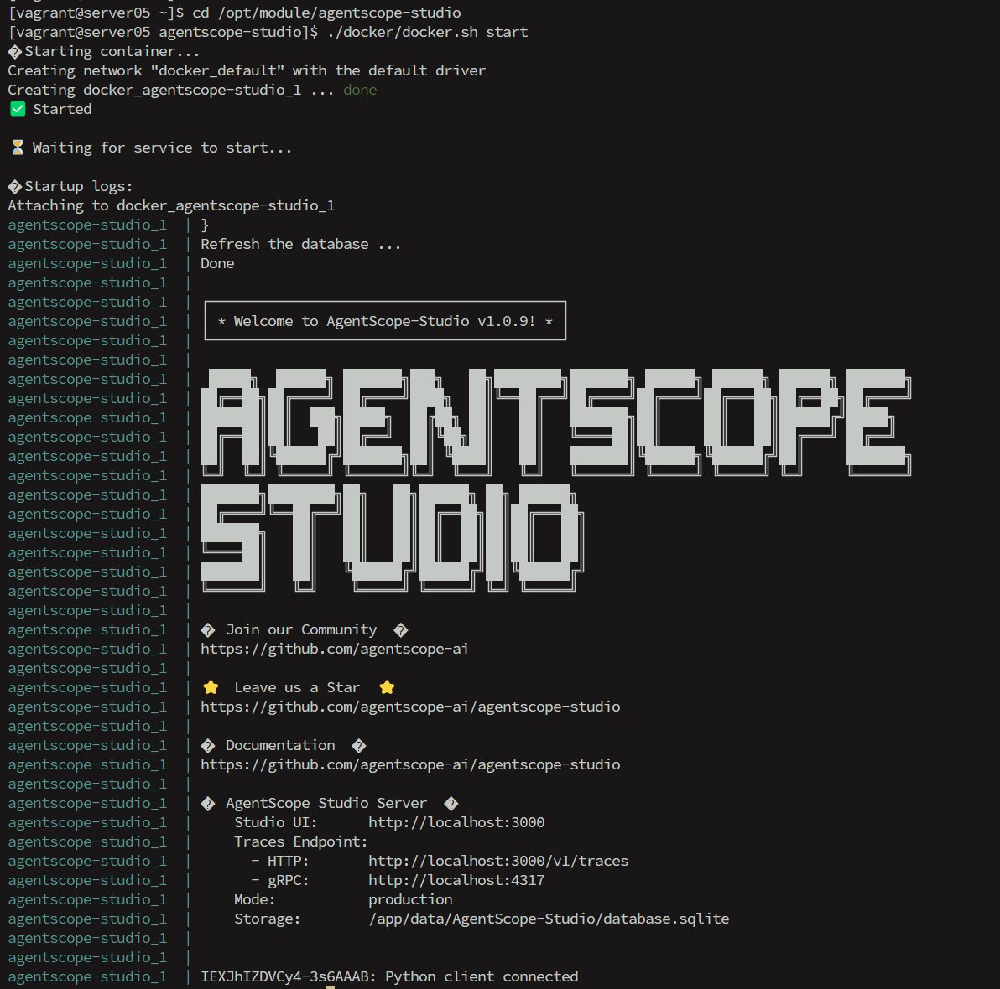
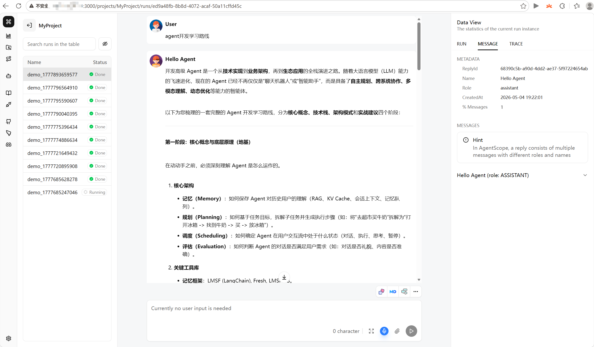

<!-- START doctoc generated TOC please keep comment here to allow auto update -->
<!-- DON'T EDIT THIS SECTION, INSTEAD RE-RUN doctoc TO UPDATE -->
**Table of Contents**  *generated with [DocToc](https://github.com/thlorenz/doctoc)*

- [1.部署 AgentScope Studio](#1%E9%83%A8%E7%BD%B2-agentscope-studio)
- [2.Ollama 实现模型本地部署](#2ollama-%E5%AE%9E%E7%8E%B0%E6%A8%A1%E5%9E%8B%E6%9C%AC%E5%9C%B0%E9%83%A8%E7%BD%B2)
- [3.AgentScope 项目搭建](#3agentscope-%E9%A1%B9%E7%9B%AE%E6%90%AD%E5%BB%BA)
- [4.控制台访问](#4%E6%8E%A7%E5%88%B6%E5%8F%B0%E8%AE%BF%E9%97%AE)

<!-- END doctoc generated TOC please keep comment here to allow auto update -->

#### 1.部署 AgentScope Studio

参考  [deploy-agentscope-studio-on-centos.md](deploy-agentscope-studio-on-centos.md)

#### 2.Ollama 实现模型本地部署

```
1.下载安装Ollama
2.启动 Ollama: ollama serve
3.确认模型存在: ollama list，看是否有配置的模型
4.拉取qwen3.5:0.8b模型:  ollama pull qwen3.5:0.8b
```

#### 3.AgentScope 项目搭建

`pom.xml`依赖：

```xml
<properties>
    <agentscope.version>1.0.10</agentscope.version>
    <java.version>21</java.version>
    <maven.compiler.source>21</maven.compiler.source>
    <maven.compiler.target>21</maven.compiler.target>
    <project.build.sourceEncoding>UTF-8</project.build.sourceEncoding>
</properties>

<!-- 统一管理依赖版本：本模块声明同名坐标且不写 version 时，采用此处版本 -->
<dependencyManagement>
    <dependencies>
        <dependency>
            <groupId>io.agentscope</groupId>
            <artifactId>agentscope-spring-boot-starter</artifactId>
            <version>${agentscope.version}</version>
        </dependency>
        <!--
            AgentScope Java（后端 SDK） 和 AgentScope Studio（前端可视化平台）是两个完全独立的项目，版本号各自独立发布，不需要、也无法强制一一对应。
            它们之间通过 HTTP 协议通信，遵循向后兼容设计，不绑定版本号。
            官方架构理念就是：松耦合、协议互通、跨框架兼容。
            AgentScope Java 和 AgentScope Studio 是两个独立的项目，版本号各自独立发布，不需要保持一致，也无法完全对应。
            它们通过稳定的 HTTP 协议通信，遵循松耦合、跨框架、向后兼容的设计理念，因此不存在版本强绑定关系
        -->
        <dependency>
            <groupId>io.agentscope</groupId>
            <artifactId>agentscope-extensions-studio</artifactId>
            <version>${agentscope.version}</version>
        </dependency>
        <dependency>
            <groupId>io.agentscope</groupId>
            <artifactId>agentscope-agui-spring-boot-starter</artifactId>
            <version>${agentscope.version}</version>
        </dependency>
        <dependency>
            <groupId>com.squareup.okhttp3</groupId>
            <artifactId>okhttp</artifactId>
            <version>5.3.2</version>
        </dependency>
        <dependency>
            <groupId>io.socket</groupId>
            <artifactId>socket.io-client</artifactId>
            <version>2.1.2</version>
        </dependency>
        <dependency>
            <groupId>io.opentelemetry</groupId>
            <artifactId>opentelemetry-api</artifactId>
            <version>1.49.0</version>
        </dependency>
        <dependency>
            <groupId>io.opentelemetry</groupId>
            <artifactId>opentelemetry-exporter-otlp</artifactId>
            <version>1.49.0</version>
        </dependency>
        <dependency>
            <groupId>io.opentelemetry.instrumentation</groupId>
            <artifactId>opentelemetry-reactor-3.1</artifactId>
            <version>2.25.0-alpha</version>
        </dependency>
    </dependencies>
</dependencyManagement>

<dependencies>
    <!-- Spring Boot 核心起步依赖（自动配置、默认日志等；不包含 Web MVC/WebFlux） -->
    <dependency>
        <groupId>org.springframework.boot</groupId>
        <artifactId>spring-boot-starter</artifactId>
    </dependency>
    <!-- Spring MVC + 嵌入式 Tomcat：阻塞式 Web / REST 接口 -->
    <dependency>
        <groupId>org.springframework.boot</groupId>
        <artifactId>spring-boot-starter-web</artifactId>
    </dependency>
    <!-- Spring WebFlux + 嵌入式 Netty：响应式 Web（与 AgentScope Reactor 风格运行时契合） -->
    <dependency>
        <groupId>org.springframework.boot</groupId>
        <artifactId>spring-boot-starter-webflux</artifactId>
    </dependency>
    <!-- AgentScope Spring Boot 起步依赖（引入 AgentScope 核心能力并完成 Spring 集成配置） -->
    <dependency>
        <groupId>io.agentscope</groupId>
        <artifactId>agentscope-spring-boot-starter</artifactId>
    </dependency>
    <!-- AgentScope Studio 扩展：接入 Studio Web 的可视化调试与 Trace / Hook -->
    <dependency>
        <groupId>io.agentscope</groupId>
        <artifactId>agentscope-extensions-studio</artifactId>
    </dependency>
    <!-- OkHttp：HTTP 客户端（REST API、gRPC-Gateway HTTP 等调用场景） -->
    <dependency>
        <groupId>com.squareup.okhttp3</groupId>
        <artifactId>okhttp</artifactId>
    </dependency>
    <!-- Socket.IO Java 客户端：与 Studio 等服务端的 Socket.IO 通道实时通信 -->
    <dependency>
        <groupId>io.socket</groupId>
        <artifactId>socket.io-client</artifactId>
    </dependency>
    <!-- OpenTelemetry API：手动或 SDK 使用的链路追踪 API -->
    <dependency>
        <groupId>io.opentelemetry</groupId>
        <artifactId>opentelemetry-api</artifactId>
    </dependency>
    <!-- OTLP Exporter：将 Trace 通过 OTLP 导出至 Collector / 观测后端 -->
    <dependency>
        <groupId>io.opentelemetry</groupId>
        <artifactId>opentelemetry-exporter-otlp</artifactId>
    </dependency>
    <!-- OTEL Reactor 仪表化：为 Mono/Flux 等响应式链路补齐 Span -->
    <dependency>
        <groupId>io.opentelemetry.instrumentation</groupId>
        <artifactId>opentelemetry-reactor-3.1</artifactId>
    </dependency>
    <!-- Lombok：编译期注解处理器，减少 getter/setter、建造者等样板代码 -->
    <dependency>
        <groupId>org.projectlombok</groupId>
        <artifactId>lombok</artifactId>
        <version>1.18.42</version>
    </dependency>
    <!-- Netty DNS 解析原生库（macOS ARM64）：在 Apple Silicon 上加速异步 DNS，常与 Netty/WebFlux 一起使用 -->
    <dependency>
        <groupId>io.netty</groupId>
        <artifactId>netty-resolver-dns-native-macos</artifactId>
        <classifier>osx-aarch_64</classifier>
    </dependency>
    <!-- dotenv-java：启动时加载 .env 并写入 System Property（与图中 Dotenv API 一致） -->
    <dependency>
        <groupId>io.github.cdimascio</groupId>
        <artifactId>dotenv-java</artifactId>
        <version>3.2.0</version>
    </dependency>

    <!-- 测试起步依赖：JUnit 5、Mockito、Spring Test、AssertJ 等 -->
    <dependency>
        <groupId>org.springframework.boot</groupId>
        <artifactId>spring-boot-starter-test</artifactId>
        <scope>test</scope>
    </dependency>
</dependencies>
```

启动类：`src/main/java/com/action/agentscope/sc01agentscope/Sc01AgentscopeQuikstartApplication.java`

```java
package com.action.agentscope.sc01agentscope;

import io.github.cdimascio.dotenv.Dotenv;
import org.springframework.boot.SpringApplication;
import org.springframework.boot.autoconfigure.SpringBootApplication;

@SpringBootApplication
public class Sc01AgentscopeQuikstartApplication {

    public static void main(String[] args) {
        // 加载 .env 文件
        Dotenv load = Dotenv.configure().ignoreIfMissing().load();
        load.entries().forEach(entry -> System.setProperty(entry.getKey(), entry.getValue()));

        SpringApplication.run(Sc01AgentscopeQuikstartApplication.class, args);
    }
}
```

模型配置：`src/main/java/com/action/agentscope/sc01agentscope/config/OllamaChatModelConfig.java`

```java
package com.action.agentscope.sc01agentscope.config;

import io.agentscope.core.model.OllamaChatModel;
import io.agentscope.core.model.ollama.OllamaOptions;
import io.agentscope.core.model.ollama.ThinkOption;
import org.springframework.context.annotation.Bean;
import org.springframework.context.annotation.Configuration;

/**
 * OllamaChatModel 配置类
 * <p>
 * 1.确保 Ollama 启动，且模型已拉取
 * 2.启动 Ollama：ollama serve
 * 3.确认模型存在：ollama list，看是否有你配置的 qwen3.5:0.8b
 * 4.如果没有，先拉取：ollama pull qwen3.5:0.8b
 */
@Configuration
public class OllamaChatModelConfig {

    /**
     * 禁用Ollama的思考模式
     * 关闭思考模式:  响应极快，资源占用极低，成本更低。能直接获取最终答案，输出内容更简洁。
     */
    @Bean
    public OllamaChatModel ollamaChatModel() {
        return OllamaChatModel.builder()
                .defaultOptions(OllamaOptions.builder().thinkOption(ThinkOption.ThinkBoolean.DISABLED).build())
                .modelName("qwen3.5:0.8b")
                .build();
    }

    /*
    @Bean
    public OllamaChatModel ollamaChatModel() {
        return OllamaChatModel.builder()
                .modelName("qwen3.5:0.8b")
                .build();
    }
    */
}
```

配置Agent：`src/main/java/com/action/agentscope/sc01agentscope/config/ReactAgentConfig.java`

```java
package com.action.agentscope.sc01agentscope.config;

import io.agentscope.core.ReActAgent;
import io.agentscope.core.agent.Agent;
import io.agentscope.core.model.OllamaChatModel;
import io.agentscope.core.studio.StudioManager;
import io.agentscope.core.studio.StudioMessageHook;
import io.agentscope.core.tool.Toolkit;
import org.springframework.beans.factory.config.ConfigurableBeanFactory;
import org.springframework.context.annotation.Bean;
import org.springframework.context.annotation.Configuration;
import org.springframework.context.annotation.DependsOn;
import org.springframework.context.annotation.Scope;

@Configuration
public class ReactAgentConfig {


    @Bean
    @DependsOn("studioLifecycle")
    @Scope(ConfigurableBeanFactory.SCOPE_PROTOTYPE)
    public Agent reactAgent(OllamaChatModel ollamaChatModel) {
        Toolkit toolkit = new Toolkit();
        return ReActAgent.builder()
                .name("Hello Agent")
                .hook(new StudioMessageHook(StudioManager.getClient()))
                .toolkit(toolkit)
                .model(ollamaChatModel)
                .build();
    }
}
```

`Studio 控制台`配置：

```java
package com.action.agentscope.sc01agentscope.init;

import io.agentscope.core.agent.Agent;
import io.agentscope.core.message.Msg;
import io.agentscope.core.studio.StudioManager;
import io.agentscope.core.studio.StudioUserAgent;
import org.springframework.boot.ApplicationArguments;
import org.springframework.boot.ApplicationRunner;
import org.springframework.context.annotation.Lazy;
import org.springframework.stereotype.Component;

import java.util.Objects;

/**
 * Studio 控制台对话循环（与 HTTP {@code /chat} 等并行）。
 * <p>
 * Studio 初始化见 {@link StudioLifecycle}；{@link Agent} 使用 {@link Lazy}，避免与 Bean 工厂阶段形成循环依赖。
 * <p>
 * 工具 {@link com.action.agentscope.sc01agentscope.tool.DateTools} 在 {@link com.action.agentscope.sc01agentscope.config.ReactAgentConfig} 中注册给 Agent。
 */
@Component("studioAgentRunner")
public class StudioAgentRunner implements ApplicationRunner {

    private final Agent agent;

    public StudioAgentRunner(@Lazy Agent agent) {
        this.agent = agent;
    }

    @Override
    public void run(ApplicationArguments args) {
        StudioUserAgent user = StudioUserAgent.builder()
                .name("User")
                .studioClient(StudioManager.getClient())
                .webSocketClient(StudioManager.getWebSocketClient())
                .build();

        System.out.println("Starting conversation (type 'exit' to quit)");
        System.out.println("Open http://192.168.56.15:3000 to interact\n");

        Msg msg = null;
        int turn = 1;
        while (true) {
            System.out.println("[Turn " + turn + "] Waiting for user input...");
            msg = user.call(msg).block();

            if (Objects.isNull(msg) || "exit".equalsIgnoreCase(msg.getTextContent())) {
                System.out.println("\nConversation ended");
                break;
            }

            System.out.println("[Turn " + turn + "] User: " + msg.getTextContent());
            msg = agent.call(msg).block();

            if (Objects.nonNull(msg)) {
                System.out.println("[Turn " + turn + "] Agent: "
                        + msg.getTextContent() + "\n");
            }
            turn++;
        }
    }
}
```

```java
package com.action.agentscope.sc01agentscope.init;

import io.agentscope.core.studio.StudioManager;
import jakarta.annotation.PostConstruct;
import jakarta.annotation.PreDestroy;
import org.springframework.stereotype.Component;

/**
 * Studio 连接生命周期（初始化 / 关闭），与 {@link Agent} 解耦，避免与 {@code reactAgent} 形成 {@code @DependsOn} 循环。
 * <p>
 * 必须在创建使用 {@link StudioManager#getClient()} 的 Bean（如带 {@link io.agentscope.core.studio.StudioMessageHook} 的 Agent）之前完成初始化。
 */
@Component("studioLifecycle")
public class StudioLifecycle {

    @PostConstruct
    public void initStudio() {
        StudioManager.init()
                .studioUrl("http://192.168.56.15:3000")
                .project("MyProject")
                .runName("demo_" + System.currentTimeMillis())
                .initialize()
                .block();
    }

    @PreDestroy
    public void destroyStudio() {
        StudioManager.shutdown();
    }
}
```

`application.yml`配置：`src/main/resources/application.yml`

```yaml
server:
  port: 8801
  servlet:
    encoding:
      charset: UTF-8
      force: true
      enabled: true
```

#### 4.控制台访问

1.启动 AgentScope Studio

```bash
cd /opt/module/agentscope-studio
./docker/docker.sh start
```



2.确保 Ollama 已经部署了qwen3.5:0.8b模型

3.访问控制台



