<!-- START doctoc generated TOC please keep comment here to allow auto update -->
<!-- DON'T EDIT THIS SECTION, INSTEAD RE-RUN doctoc TO UPDATE -->
**Table of Contents**  *generated with [DocToc](https://github.com/thlorenz/doctoc)*

- [1.AgentScope介绍](#1agentscope%E4%BB%8B%E7%BB%8D)
    - [1.1 简介](#11-%E7%AE%80%E4%BB%8B)
    - [1.2 核心竞争力](#12-%E6%A0%B8%E5%BF%83%E7%AB%9E%E4%BA%89%E5%8A%9B)
    - [1.3 功能一览](#13-%E5%8A%9F%E8%83%BD%E4%B8%80%E8%A7%88)
        - [1.3.1 ReAct 范式](#131-react-%E8%8C%83%E5%BC%8F)
        - [1.3.2 上下文工程](#132-%E4%B8%8A%E4%B8%8B%E6%96%87%E5%B7%A5%E7%A8%8B)
            - [1.3.2.1 RAG](#1321-rag)
            - [1.3.2.2 Memory](#1322-memory)
        - [1.3.3 实时介入](#133-%E5%AE%9E%E6%97%B6%E4%BB%8B%E5%85%A5)
        - [1.3.4 Planner](#134-planner)
        - [1.3.5 结构化输出](#135-%E7%BB%93%E6%9E%84%E5%8C%96%E8%BE%93%E5%87%BA)
    - [1.4 总结](#14-%E6%80%BB%E7%BB%93)
- [2.快速上手](#2%E5%BF%AB%E9%80%9F%E4%B8%8A%E6%89%8B)
    - [2.1 开发一个简单的Agent](#21-%E5%BC%80%E5%8F%91%E4%B8%80%E4%B8%AA%E7%AE%80%E5%8D%95%E7%9A%84agent)
    - [2.2 切换模型&调整模型行为](#22-%E5%88%87%E6%8D%A2%E6%A8%A1%E5%9E%8B%E8%B0%83%E6%95%B4%E6%A8%A1%E5%9E%8B%E8%A1%8C%E4%B8%BA)
    - [2.3 为智能体增加工具](#23-%E4%B8%BA%E6%99%BA%E8%83%BD%E4%BD%93%E5%A2%9E%E5%8A%A0%E5%B7%A5%E5%85%B7)
    - [2.4 控制 Agent 更多行为](#24-%E6%8E%A7%E5%88%B6-agent-%E6%9B%B4%E5%A4%9A%E8%A1%8C%E4%B8%BA)
    - [2.5 使用Hook嵌入自定义逻辑](#25-%E4%BD%BF%E7%94%A8hook%E5%B5%8C%E5%85%A5%E8%87%AA%E5%AE%9A%E4%B9%89%E9%80%BB%E8%BE%91)
    - [2.6 工具(Tool)的使用](#26-%E5%B7%A5%E5%85%B7tool%E7%9A%84%E4%BD%BF%E7%94%A8)
    - [2.7 使用RAG集成私域数据](#27-%E4%BD%BF%E7%94%A8rag%E9%9B%86%E6%88%90%E7%A7%81%E5%9F%9F%E6%95%B0%E6%8D%AE)
    - [2.8 使用Hook嵌入自定义逻辑](#28-%E4%BD%BF%E7%94%A8hook%E5%B5%8C%E5%85%A5%E8%87%AA%E5%AE%9A%E4%B9%89%E9%80%BB%E8%BE%91)
- [3.使用Tool和MCP帮助Agent探索真实世界](#3%E4%BD%BF%E7%94%A8tool%E5%92%8Cmcp%E5%B8%AE%E5%8A%A9agent%E6%8E%A2%E7%B4%A2%E7%9C%9F%E5%AE%9E%E4%B8%96%E7%95%8C)
    - [3.1 Tool](#31-tool)
    - [3.2 MCP](#32-mcp)
    - [3.3 代码实操](#33-%E4%BB%A3%E7%A0%81%E5%AE%9E%E6%93%8D)
    - [3.4 总结](#34-%E6%80%BB%E7%BB%93)
- [4.RAG：赋予 Agent 私域知识](#4rag%E8%B5%8B%E4%BA%88-agent-%E7%A7%81%E5%9F%9F%E7%9F%A5%E8%AF%86)
    - [4.1 RAG 简介](#41-rag-%E7%AE%80%E4%BB%8B)
    - [4.2 AgentScope 的 RAG实现](#42-agentscope-%E7%9A%84-rag%E5%AE%9E%E7%8E%B0)
        - [4.2.1 Knowledge 知识库](#421-knowledge-%E7%9F%A5%E8%AF%86%E5%BA%93)
        - [4.2.2 AgentScope的RAG集成模式](#422-agentscope%E7%9A%84rag%E9%9B%86%E6%88%90%E6%A8%A1%E5%BC%8F)
        - [4.2.3 使用百炼知识库](#423-%E4%BD%BF%E7%94%A8%E7%99%BE%E7%82%BC%E7%9F%A5%E8%AF%86%E5%BA%93)
    - [4.3 Demo与实践](#43-demo%E4%B8%8E%E5%AE%9E%E8%B7%B5)
- [5.记忆：让Agent迈向更高阶的智能](#5%E8%AE%B0%E5%BF%86%E8%AE%A9agent%E8%BF%88%E5%90%91%E6%9B%B4%E9%AB%98%E9%98%B6%E7%9A%84%E6%99%BA%E8%83%BD)
    - [5.1 Agent记忆：短期记忆&长期记忆](#51-agent%E8%AE%B0%E5%BF%86%E7%9F%AD%E6%9C%9F%E8%AE%B0%E5%BF%86%E9%95%BF%E6%9C%9F%E8%AE%B0%E5%BF%86)
    - [5.2 短期记忆：智能上下文管理AutoContextMemory](#52-%E7%9F%AD%E6%9C%9F%E8%AE%B0%E5%BF%86%E6%99%BA%E8%83%BD%E4%B8%8A%E4%B8%8B%E6%96%87%E7%AE%A1%E7%90%86autocontextmemory)
    - [5.3 长期记忆：原理介绍及框架集成](#53-%E9%95%BF%E6%9C%9F%E8%AE%B0%E5%BF%86%E5%8E%9F%E7%90%86%E4%BB%8B%E7%BB%8D%E5%8F%8A%E6%A1%86%E6%9E%B6%E9%9B%86%E6%88%90)
    - [5.4 总结](#54-%E6%80%BB%E7%BB%93)
- [6.结构化输出：将 Agent 应用整合到业务系统中的桥梁](#6%E7%BB%93%E6%9E%84%E5%8C%96%E8%BE%93%E5%87%BA%E5%B0%86-agent-%E5%BA%94%E7%94%A8%E6%95%B4%E5%90%88%E5%88%B0%E4%B8%9A%E5%8A%A1%E7%B3%BB%E7%BB%9F%E4%B8%AD%E7%9A%84%E6%A1%A5%E6%A2%81)
    - [6.1 使用简单的结构化Agent 输出](#61-%E4%BD%BF%E7%94%A8%E7%AE%80%E5%8D%95%E7%9A%84%E7%BB%93%E6%9E%84%E5%8C%96agent-%E8%BE%93%E5%87%BA)
    - [6.2 将复杂结构化输出和真实工具调用场景相结合](#62-%E5%B0%86%E5%A4%8D%E6%9D%82%E7%BB%93%E6%9E%84%E5%8C%96%E8%BE%93%E5%87%BA%E5%92%8C%E7%9C%9F%E5%AE%9E%E5%B7%A5%E5%85%B7%E8%B0%83%E7%94%A8%E5%9C%BA%E6%99%AF%E7%9B%B8%E7%BB%93%E5%90%88)
- [7.Agent Scope Java vs Studio](#7agent-scope-java-vs-studio)
    - [7.1 Agent Scope Studio介绍、安装与使用](#71-agent-scope-studio%E4%BB%8B%E7%BB%8D%E5%AE%89%E8%A3%85%E4%B8%8E%E4%BD%BF%E7%94%A8)
    - [7.2 Agent Scope Java在开发形态下 Studio 协作方式](#72-agent-scope-java%E5%9C%A8%E5%BC%80%E5%8F%91%E5%BD%A2%E6%80%81%E4%B8%8B-studio-%E5%8D%8F%E4%BD%9C%E6%96%B9%E5%BC%8F)
    - [7.3 演示](#73-%E6%BC%94%E7%A4%BA)
    - [7.4 AI可观测系统性介绍](#74-ai%E5%8F%AF%E8%A7%82%E6%B5%8B%E7%B3%BB%E7%BB%9F%E6%80%A7%E4%BB%8B%E7%BB%8D)
    - [7.5 生产环境下的可观测演示](#75-%E7%94%9F%E4%BA%A7%E7%8E%AF%E5%A2%83%E4%B8%8B%E7%9A%84%E5%8F%AF%E8%A7%82%E6%B5%8B%E6%BC%94%E7%A4%BA)
- [8.Plan：让Agent能自主分解复杂任务](#8plan%E8%AE%A9agent%E8%83%BD%E8%87%AA%E4%B8%BB%E5%88%86%E8%A7%A3%E5%A4%8D%E6%9D%82%E4%BB%BB%E5%8A%A1)
    - [8.1 PlanNotebook 介绍](#81-plannotebook-%E4%BB%8B%E7%BB%8D)
    - [8.2 PlanNotebook Example 演示](#82-plannotebook-example-%E6%BC%94%E7%A4%BA)
    - [8.3 PlanNotebook实现原理](#83-plannotebook%E5%AE%9E%E7%8E%B0%E5%8E%9F%E7%90%86)
- [9.ToolGroup：帮助模型面对大量Tool时更好地决策](#9toolgroup%E5%B8%AE%E5%8A%A9%E6%A8%A1%E5%9E%8B%E9%9D%A2%E5%AF%B9%E5%A4%A7%E9%87%8Ftool%E6%97%B6%E6%9B%B4%E5%A5%BD%E5%9C%B0%E5%86%B3%E7%AD%96)
    - [9.1 规模化工具调用的挑战与瓶颈](#91-%E8%A7%84%E6%A8%A1%E5%8C%96%E5%B7%A5%E5%85%B7%E8%B0%83%E7%94%A8%E7%9A%84%E6%8C%91%E6%88%98%E4%B8%8E%E7%93%B6%E9%A2%88)
    - [9.2 AgentScope Java Tool Group 解决方案](#92-agentscope-java-tool-group-%E8%A7%A3%E5%86%B3%E6%96%B9%E6%A1%88)
    - [9.3 工具分组的创建、注册与动态激活流程](#93-%E5%B7%A5%E5%85%B7%E5%88%86%E7%BB%84%E7%9A%84%E5%88%9B%E5%BB%BA%E6%B3%A8%E5%86%8C%E4%B8%8E%E5%8A%A8%E6%80%81%E6%BF%80%E6%B4%BB%E6%B5%81%E7%A8%8B)
- [10.Agent Debate：以狼人杀为例探讨多Agent系统难点](#10agent-debate%E4%BB%A5%E7%8B%BC%E4%BA%BA%E6%9D%80%E4%B8%BA%E4%BE%8B%E6%8E%A2%E8%AE%A8%E5%A4%9Aagent%E7%B3%BB%E7%BB%9F%E9%9A%BE%E7%82%B9)
    - [10.1 项目介绍](#101-%E9%A1%B9%E7%9B%AE%E4%BB%8B%E7%BB%8D)
    - [10.2 核心挑战与解决方案](#102-%E6%A0%B8%E5%BF%83%E6%8C%91%E6%88%98%E4%B8%8E%E8%A7%A3%E5%86%B3%E6%96%B9%E6%A1%88)
        - [10.2.1 持续思考—ReAct Agent](#1021-%E6%8C%81%E7%BB%AD%E6%80%9D%E8%80%83react-agent)
        - [10.2.2 信息隔离—MsgHub](#1022-%E4%BF%A1%E6%81%AF%E9%9A%94%E7%A6%BBmsghub)
        - [10.2.3 多人对话—MultiAgentFormatter](#1023-%E5%A4%9A%E4%BA%BA%E5%AF%B9%E8%AF%9Dmultiagentformatter)
        - [10.2.4 决策明确—Structured Output](#1024-%E5%86%B3%E7%AD%96%E6%98%8E%E7%A1%AEstructured-output)
        - [10.2.5 流程控制](#1025-%E6%B5%81%E7%A8%8B%E6%8E%A7%E5%88%B6)
        - [10.2.6 人机对战—Human in the Loop](#1026-%E4%BA%BA%E6%9C%BA%E5%AF%B9%E6%88%98human-in-the-loop)
        - [10.2.7 总结](#1027-%E6%80%BB%E7%BB%93)
- [11.A2A：多Agent分布式对话的桥梁](#11a2a%E5%A4%9Aagent%E5%88%86%E5%B8%83%E5%BC%8F%E5%AF%B9%E8%AF%9D%E7%9A%84%E6%A1%A5%E6%A2%81)
    - [11.1 A2A (Agent2Agent) 简介](#111-a2a-agent2agent-%E7%AE%80%E4%BB%8B)
    - [11.2 在AgentScope Java 中使用 A2A 协议](#112-%E5%9C%A8agentscope-java-%E4%B8%AD%E4%BD%BF%E7%94%A8-a2a-%E5%8D%8F%E8%AE%AE)
    - [11.3 通过Nacos进行A2A Agent 的注册与发现](#113-%E9%80%9A%E8%BF%87nacos%E8%BF%9B%E8%A1%8Ca2a-agent-%E7%9A%84%E6%B3%A8%E5%86%8C%E4%B8%8E%E5%8F%91%E7%8E%B0)

<!-- END doctoc generated TOC please keep comment here to allow auto update -->

## 1.AgentScope介绍

### 1.1 简介

阿里巴巴推出的一款以开发者为核心、专注于智能体开发的开源框架、继 ModelScope 在 Al Agent 领域的战略级产品

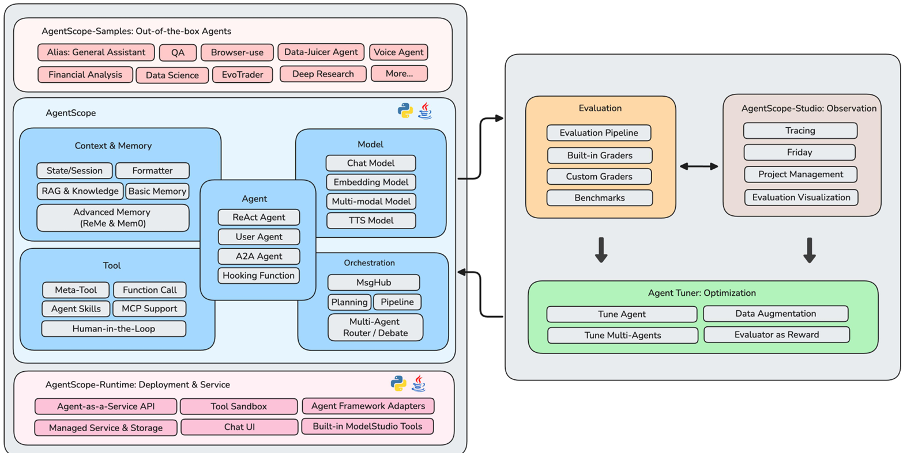

### 1.2 核心竞争力

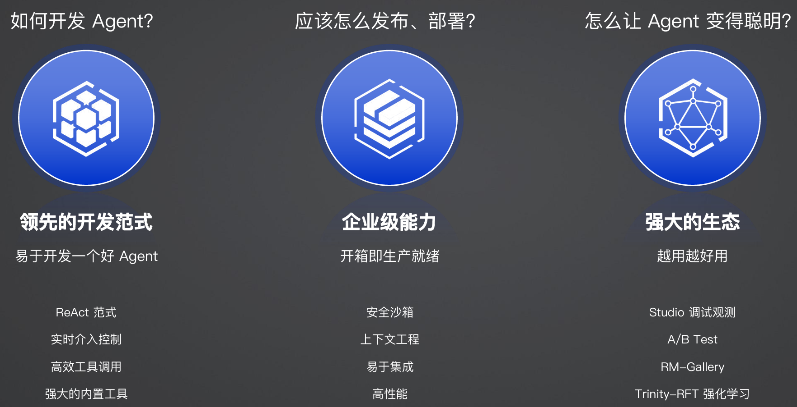


### 1.3 功能一览

#### 1.3.1 ReAct 范式

Re-Act范式：先分析当前的场景，制定后续计划；然后根据思考结果，采取具体行动；最后得出结果

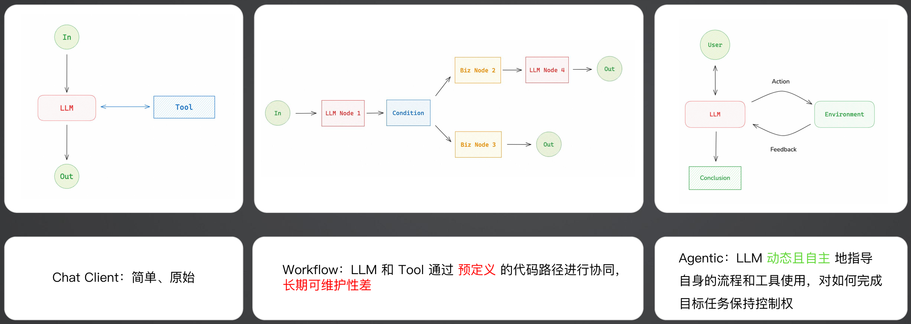

优势：

- 简单：和人的思考逻辑一样，易于理解
- 可扩展：核心流程上支持灵活的自定义扩展
- 易于对模型进行评估、训练以提升效果

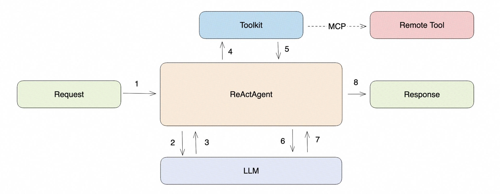


#### 1.3.2 上下文工程

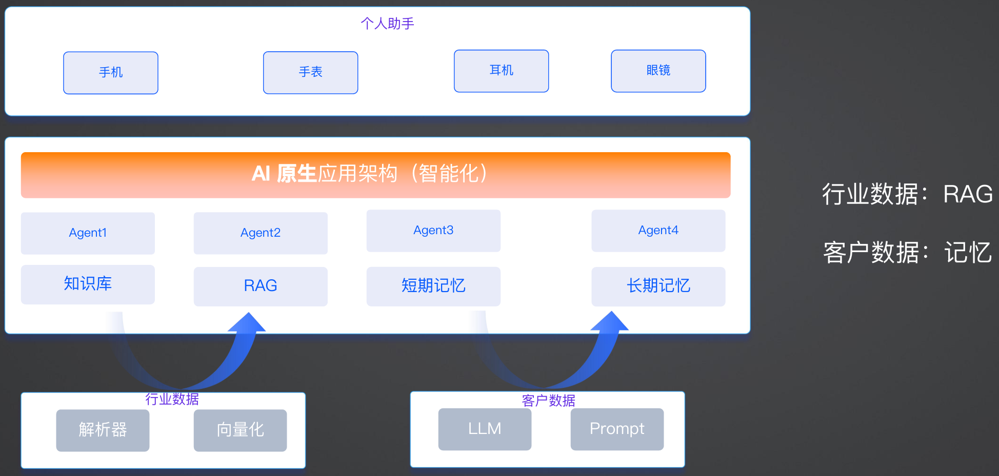

##### 1.3.2.1 RAG

内置实现：自主可控

- AgentScope Java内置基于Embedding标准的知识库实现，支持企业面对多元业务数据时，私有化部署自有知识体系，实现对数据的完全自主可控。

企业级集成：高效&易用

- 集成阿里云百炼企业级知识库，借助其强大的商业化检索与重排序能力，大幅提升Agent回答的准确率和相关性。

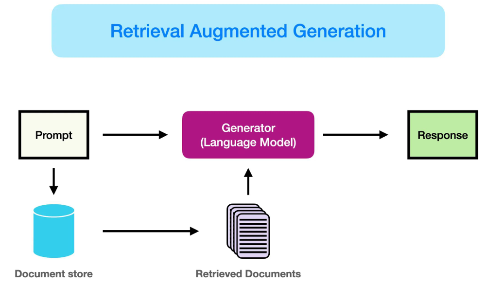

##### 1.3.2.2 Memory

短期记忆：AutoContextMemory组件实现Agent工作上下文智能管理（压缩-卸载）

长期记忆：提供长期记忆框架ReMe，支持在用户、任务与智能体之间提取、复用与共享记忆。

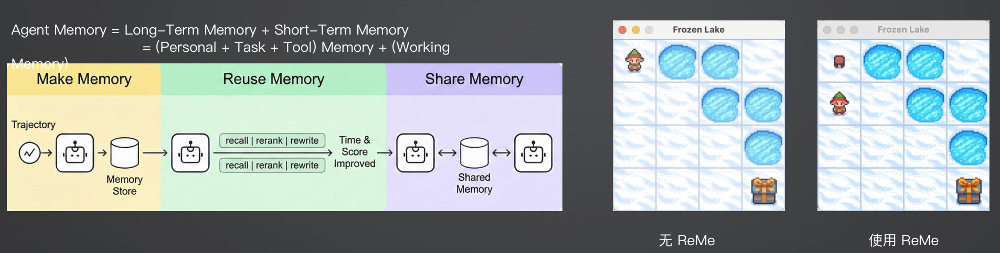

#### 1.3.3 实时介入

工具打断：工具执行时间过长，用户希望主动打断

推理打断：模型流式输出过程中，用户发现模型的思考出现问题，希望主动介入修正模型的思考

AgentScope框架原生支持：

- 原生提供interrupt)）方法，用户可以随时对正在执行中的Agent 进行打断
- AgentScope会将对应时间的状态保存下来，允许用户介入以后继续执行

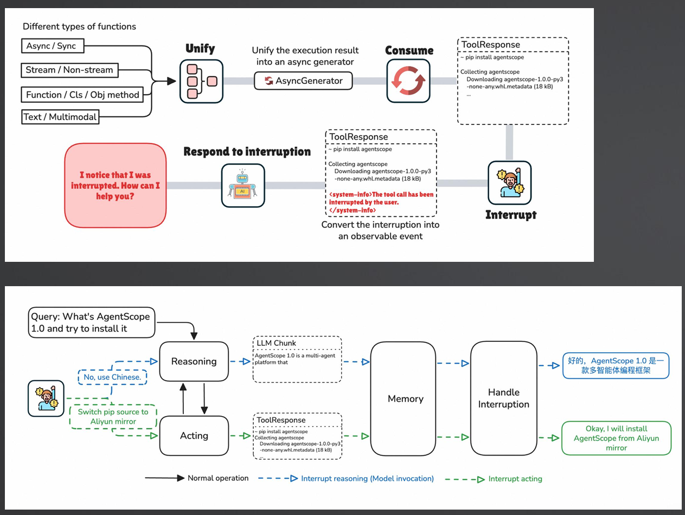

#### 1.3.4 Planner

Plan/Act通过分离规划与实施阶段，有效避免了Agent“边想边做”导致的发散问题，广泛应用于Manus、Coding等领域

AgentScope 内置了开箱即用的MetaPlanner组件，原生支持Agent自主、用户主动制定计划，Agent遵循对应Plan执行任务

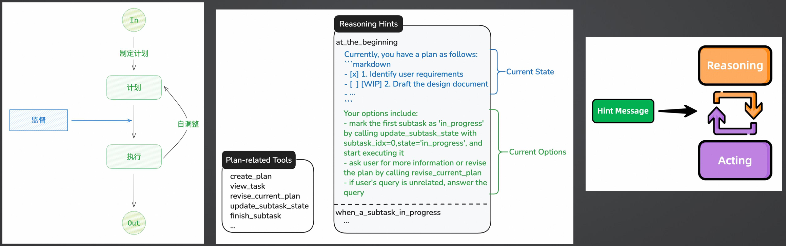

#### 1.3.5 结构化输出

场景：将Agent与业务系统结合的最佳方式——结构化数据

问题：LLM的结构化输出并不能适配Re-Act范式下的结构化输出需要

解法：提供generate_response工具，引导Agent自主决定在合适的时机生成结构化数据

AgentScope 功能优势

- 挑战：LLM没有调用工具、输出的JSON结构异常
- 方案：Agent主动提醒，切换使用LLM自身的结构化输出
- 效果：Agent 拥有自我纠错的能力

### 1.4 总结

总结：

- 无需切换技术栈，用Java原生路径，开启AI智能体开发的无限可能。

AgentScope 发展方向：

- 上下文工程：未来开发者不需要关心上下文的技术细节，只需要专注于定义好Agent 的功能。
- 实时全模态：未来 Agent 不只是文本输入，完全可以通过“眼”、“耳”和“手”更好地服务用户。
- 后训练：Agent在与用户或环境的交互中不断进化，实现真正的自我成长与迭代

## 2.快速上手

### 2.1 开发一个简单的Agent

name(Required)。每个Agent都需要一个唯一的标识符。尤其是在多智能体协作是会非常有用，用来标识不同智能体角色。

model(Rquired)。指定支持Agent推理的底层LLM需要指定使用的modelname、apikey等。模型的选择会影响agent的能力、成本和性能。
systemPrompt (Optional)。通过system prompt来设置agent的角色、职责与基本行为。

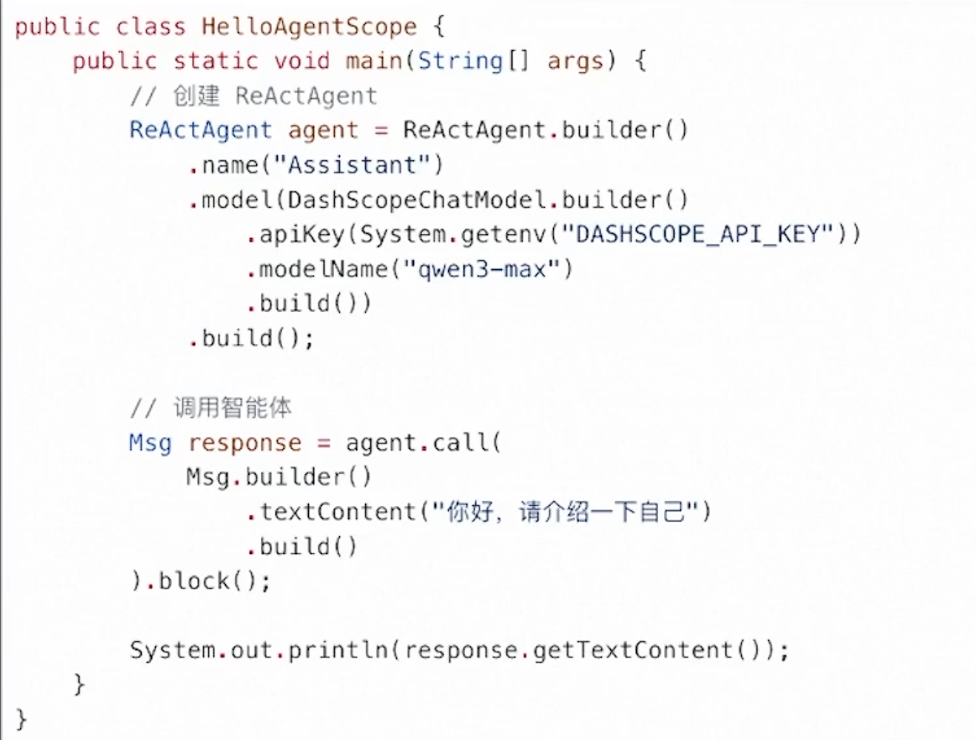

### 2.2 切换模型&调整模型行为

支持的模型：

- DashScope
- OpenAl(含OpenAlAPI兼容的模型服务）
- Gemini
- Anthropic

GenerateOptions(Optional)。通过Options参数设置模型的行为。

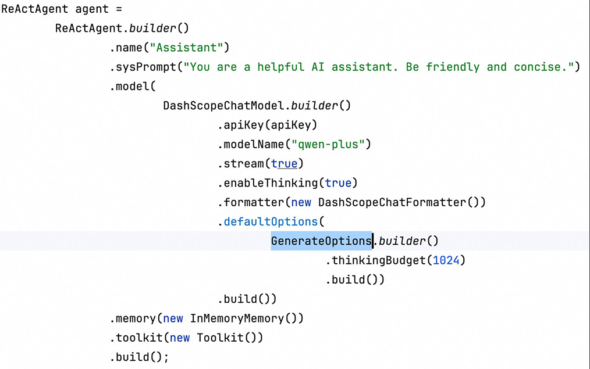

### 2.3 为智能体增加工具

toolkit(optional）。工具系统使智能体能够突破纯文本生成的限制，执行诸如API调用、数据库查询、文件操作等外部操作。

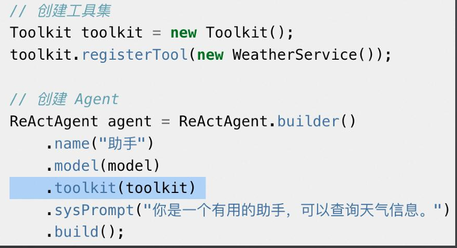

通过@Tool注解、AgentTool接口等多种方式定义工具。

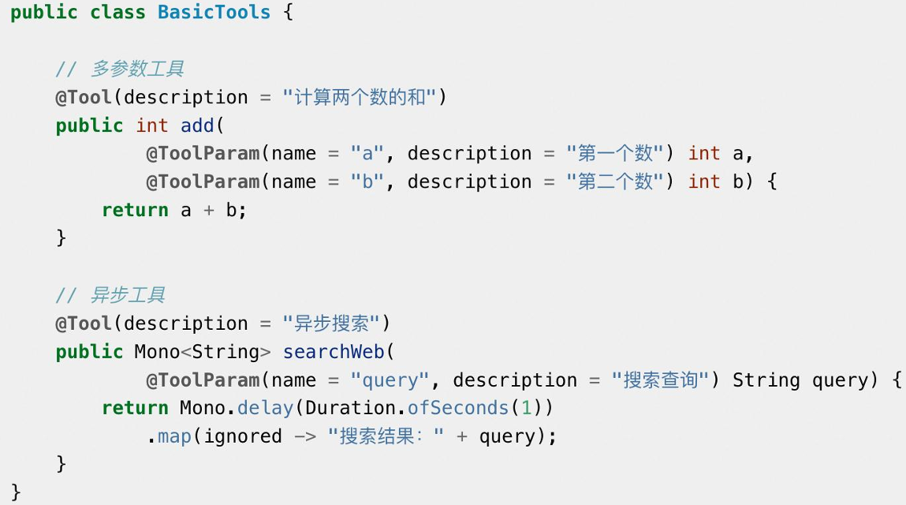

### 2.4 控制 Agent 更多行为

以下为可选配置项，用于进一步控制 Agent 行为（均可在构建 Agent 时链式调用）。

**maxIters（optional）** 。Agent 最大迭代次数（推理 + 工具执行循环）。

```java
.maxIters(10) // 最多执行 10 次循环（默认值）
```

**checkRunning（optional）**。 控制是否检查 Agent 是否正在运行中。

```java
.checkRunning(true)   // 默认值：阻止并发调用
.

checkRunning(false)  // 允许并发调用
```

**modelExecutionConfig（optional）**。模型调用的执行配置，控制超时和重试行为。

```java
.modelExecutionConfig(modelConfig)
```

**toolExecutionConfig（optional）**。工具调用的执行配置，控制工具执行的超时和重试行为。

```java
ExecutionConfig toolConfig = ExecutionConfig.builder()
        .timeout(Duration.ofSeconds(30)) // 工具执行超时：30 秒
```

**hooks（optional）**。事件监听器，用于监控和扩展 Agent 行为。

```java
.hook(new LoggingHook())
```

### 2.5 使用Hook嵌入自定义逻辑

AgentScope Java使用统一事件模型，所有Hook都需要实onEvent(HookEvent)方法。Hook典型应用场景包括：监控、上下文压缩、日志、限流等。

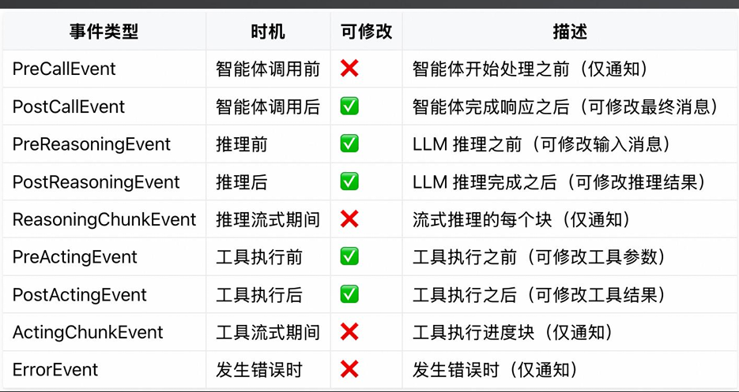

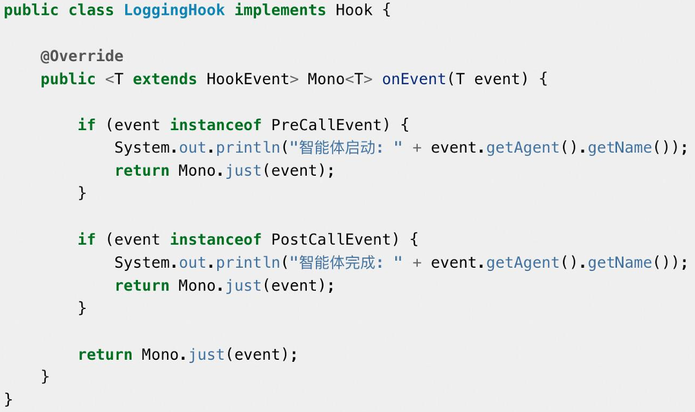

### 2.6 工具(Tool)的使用

工具(Tool)的使用流程：

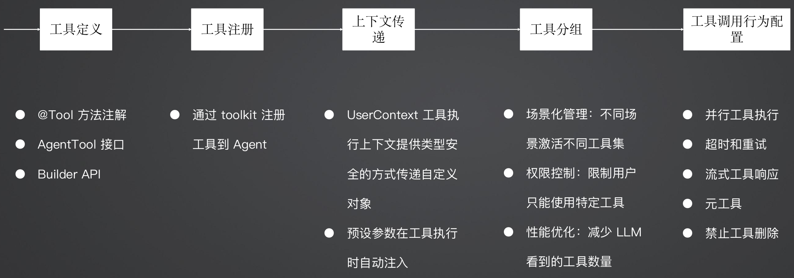

工具(Tool)使用示例：

> 示例一：使用工具上下文

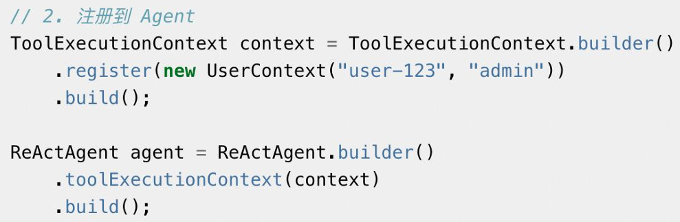

> 示例二：超时和重试

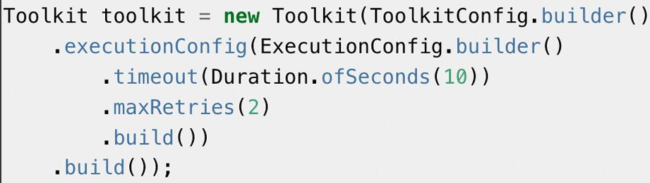

> 示例三：使用工具分组

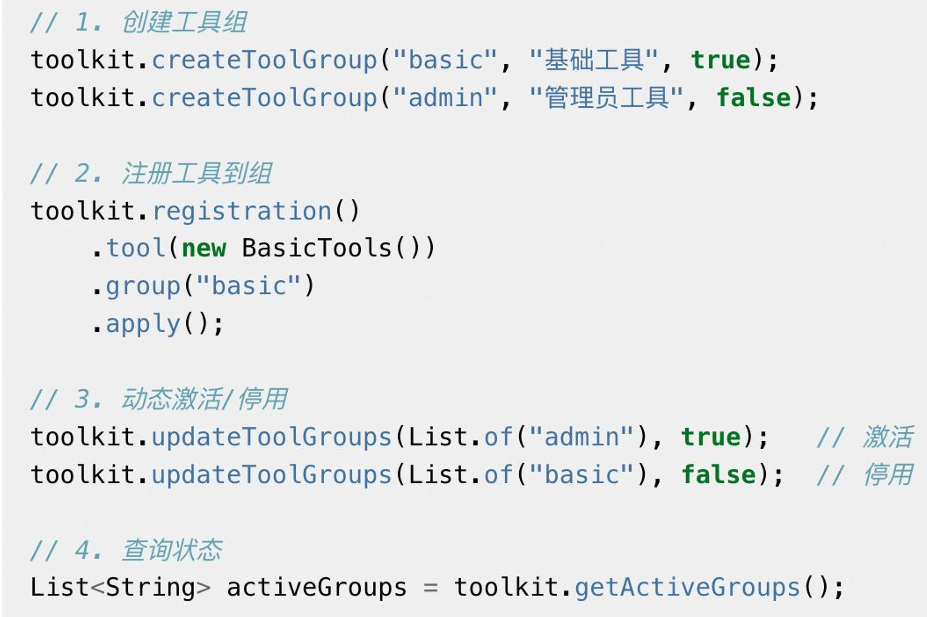

### 2.7 使用RAG集成私域数据

AgentScope 中的核心 RAG组件

- Reader（读取器）：负责读取和分块输入文档，将其转换为可处理的单元
- Knowledge（知识库）：负责存储文档、生成嵌入向量以及检索相关信息

AgentScope支持的RAG部署架构

| 类型              | 实现                 | 支持功能       | 文档管理              | 适用场景             |
|:----------------|:-------------------|:-----------|:------------------|:-----------------|
| **本地知识库**       | `SimpleKnowledge`  | 完整的文档管理和检索 | 通过代码管理（使用 Reader） | 开发、测试、完全控制数据     |
| **云托管知识库**      | `BailianKnowledge` | 仅检索        | 百炼控制台             | 企业级、多轮对话、查询重写    |
| **Dify 知识库**    | `DifyKnowledge`    | 仅检索        | Dify 控制台          | 多种检索模式、Reranking |
| **RAGFlow 知识库** | `RAGFlowKnowledge` | 仅检索        | RAGFlow 控制台       | 强大OCR、知识图谱、多数据集  |

### 2.8 使用Hook嵌入自定义逻辑

AgentScope中的核心 RAG组件

- Reader（读取器）：负责读取和分块输入文档，将其转换为可处理的单元
- Knowledge（知识库）：负责存储文档、生成嵌入向量以及检索相关信息

AgentScope支持的RAG部署架构

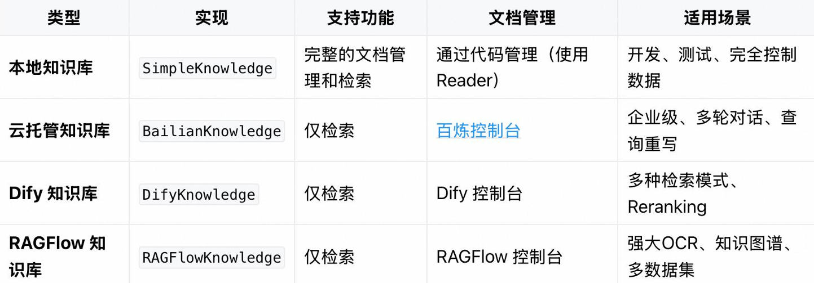

## 3.使用Tool和MCP帮助Agent探索真实世界

### 3.1 Tool

Tool（工具）：本质上是模型可以调用的外部接口，使得模型的能力得以延伸至其静态训练数据之外。

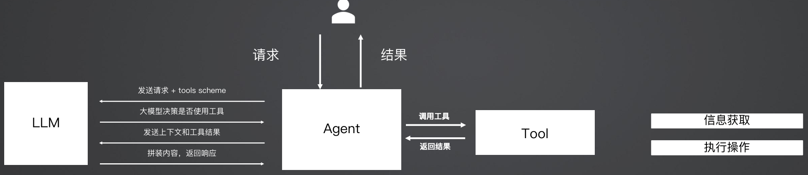

### 3.2 MCP

MCP(ModelContextProtocol，模型上下文协议），使用统一的客户端-服务器架构实现LLM和外部数据源及工具的调用

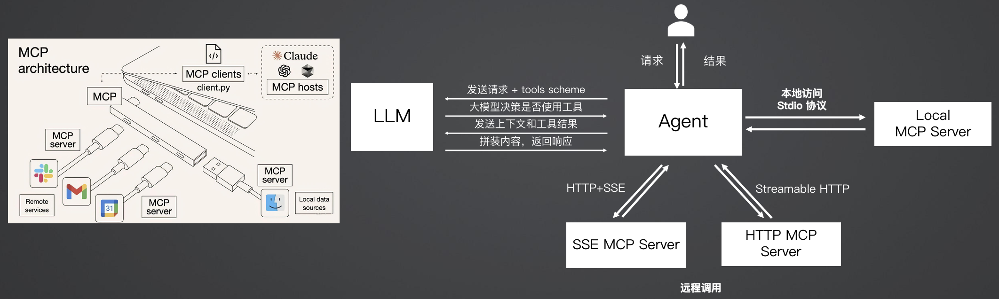

### 3.3 代码实操

运行前请配置环境变量 **`DASHSCOPE_API_KEY`**（或通过官方示例中的交互方式录入）。

```java
package io.agentscope.examples.quickstart;

import io.agentscope.core.ReActAgent;
import io.agentscope.core.formatter.dashscope.DashScopeChatFormatter;
import io.agentscope.core.memory.InMemoryMemory;
import io.agentscope.core.model.DashScopeChatModel;
import io.agentscope.core.tool.Tool;
import io.agentscope.core.tool.ToolParam;
import io.agentscope.core.tool.Toolkit;
import io.agentscope.core.tool.mcp.McpClientBuilder;
import io.agentscope.core.tool.mcp.McpClientWrapper;

import java.time.LocalDateTime;
import java.time.ZoneId;
import java.time.format.DateTimeFormatter;

public class AgentDemo {

    public static class simpleTool {
        @Tool(
                name = "time",
                description = "Get the current time in the specified time zone."
        )
        public String getCurrentTime(
                @ToolParam(name = "timezone", description = "Time zone,eg,'Asia/Tokyo'") String timezone
        ) {
            try { //根据timezone返回当前的时间
                return LocalDateTime.now(ZoneId.of(timezone)).format(DateTimeFormatter.ISO_LOCAL_DATE_TIME);
            } catch (Exception e) {
                return "Error: Invalid timezone. Try 'Asia/Tokyo' or 'America/New_York'";
            }
        }
    }

    public static void main(String[] args) throws Exception {

        // Get API key (from environment or interactive input)
        String apiKey = System.getenv("DASHSCOPE_API_KEY");

        Toolkit toolkit = new Toolkit();
        toolkit.registerTool(new simpleTool());
        McpClientBuilder builder = McpClientBuilder.create("mcp").sseTransport("https://mcp.higress.ai/mcp-calendar-holiday-helper/cmj8bflca0");
        McpClientWrapper client = builder.buildAsync().block();
        toolkit.registerMcpClient(client).block();

        // Create Agent with minimal configuration
        ReActAgent agent =
                ReActAgent.builder()
                        .name("Assistant")
                        .sysPrompt("You are a helpful AI assistant. Be friendly and concise.use Chinese to reply.")
                        .model(
                                DashScopeChatModel.builder()
                                        .apiKey(apiKey)
                                        .modelName("qwen-plus")
                                        .stream(true)
                                        .formatter(new DashScopeChatFormatter())
                                        .build())
                        .memory(new InMemoryMemory())
                        .toolkit(toolkit)
                        .build();

        // Start interactive chat
        ExampleUtils.startChat(agent);
    }
}
```

### 3.4 总结

在AgentScope Java框架中通过自定义Tool和MCP(模型上下文协议)为AI智能体赋予与外部世界交互的能力

## 4.RAG：赋予 Agent 私域知识

### 4.1 RAG 简介

什么是RAG(检索增强生成)

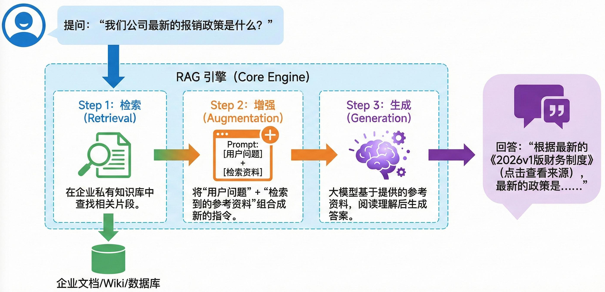

为什么需要RAG

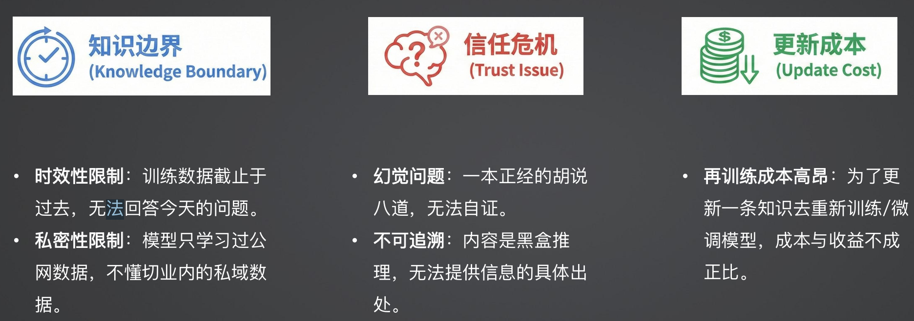

### 4.2 AgentScope 的 RAG实现

#### 4.2.1 Knowledge 知识库

知识库Indexing流程

1. 接收由Reader读取并分块后的Document列表。

2. 调用Embedding模型(如text-embedding-v3)将文档块转换为高维向量。

3. 将向量及文档元数据批量存储到向量数据库。

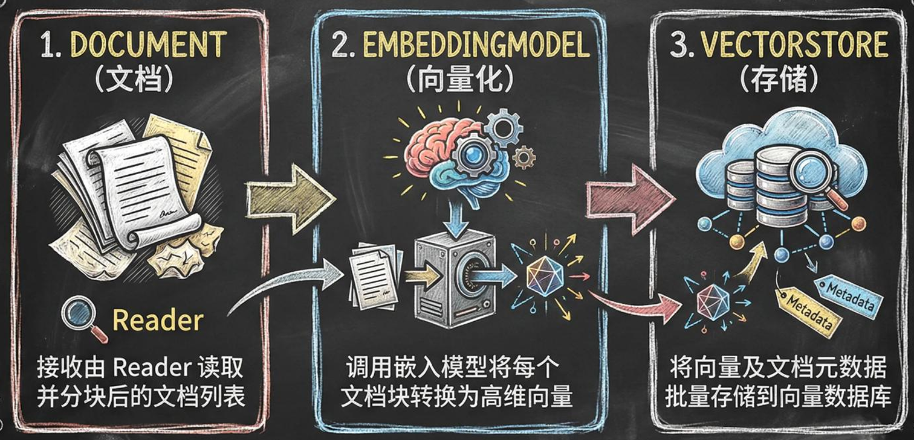

#### 4.2.2 AgentScope的RAG集成模式

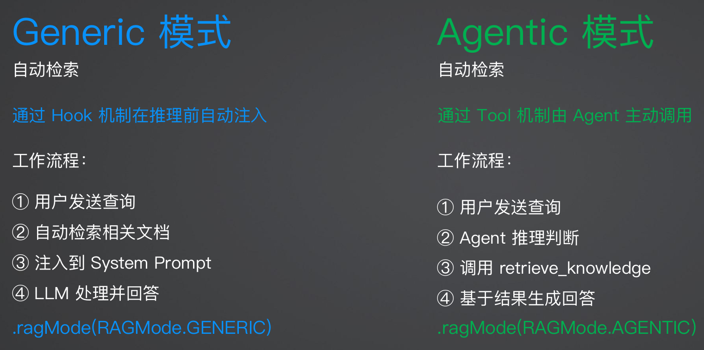

#### 4.2.3 使用百炼知识库

> 1.配置阿里云账号的访问凭证
>
> 2.配置百炼工作空间id
>
> 3.配置百炼知识库id
>
> 4.开启Reranking和 Rewrite(可选)

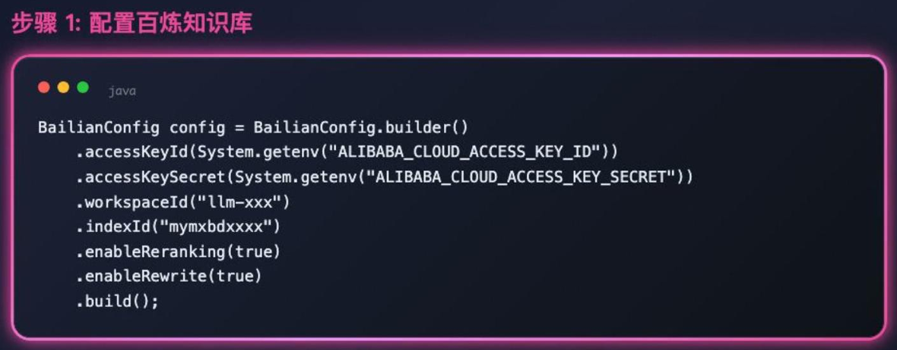

> 1.为ReactAgent添加百炼知识库
>
> 2.选择RagMode，推进使用Agentic

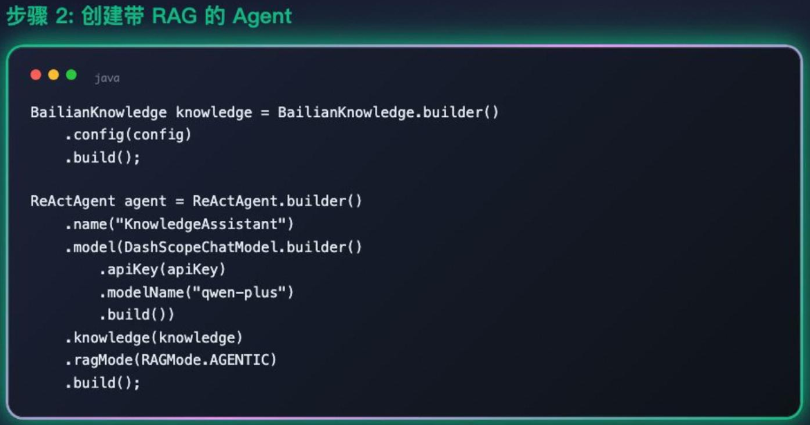

### 4.3 Demo与实践

环境变量

| 变量名                               | 说明                      |
|:----------------------------------|:------------------------|
| `ALIBABA_CLOUD_ACCESS_KEY_ID`     | 阿里云 AccessKey ID        |
| `ALIBABA_CLOUD_ACCESS_KEY_SECRET` | 阿里云 AccessKey Secret    |
| `DASHSCOPE_API_KEY`               | DashScope API Key（对话模型） |
| `BAILIAN_WORKSPACE_ID`            | 百炼工作空间 ID               |
| `BAILIAN_INDEX_ID`                | 百炼知识库（索引）ID             |

```java
import io.agentscope.core.ReActAgent;
import io.agentscope.core.agent.user.UserAgent;
import io.agentscope.core.memory.InMemoryMemory;
import io.agentscope.core.message.Msg;
import io.agentscope.core.model.DashScopeChatModel;
import io.agentscope.core.model.Model;
import io.agentscope.core.rag.RAGMode;
import io.agentscope.core.rag.integration.bailian.BailianConfig;
import io.agentscope.core.rag.integration.bailian.BailianKnowledge;
import org.slf4j.Logger;
import org.slf4j.LoggerFactory;

public class BailianRagDemo {
    private static final Logger log = LoggerFactory.getLogger(BailianRagDemo.class);

    public static void main(String[] args) throws Exception {

        String accessKeyId = System.getenv("ALIBABA_CLOUD_ACCESS_KEY_ID");
        String accessKeySecret = System.getenv("ALIBABA_CLOUD_ACCESS_KEY_SECRET");
        String dashScopeApiKey = System.getenv("DASHSCOPE_API_KEY");
        String workspaceId = System.getenv("BAILIAN_WORKSPACE_ID");
        String indexId = System.getenv("BAILIAN_INDEX_ID");

        // Step 1: Configure Bailian Knowledge Base (配置百炼知识库)
        BailianConfig config = BailianConfig.builder()
                .accessKeyId(accessKeyId)
                .accessKeySecret(accessKeySecret)
                .workspaceId(workspaceId)
                .indexId(indexId)
                .enableReranking(true) // Enable reranking for better relevance
                .enableRewrite(true) // Enable query rewriting for better retrieval
                .build();

        // Step 2: Create Knowledge instance
        BailianKnowledge knowledge = BailianKnowledge.builder().config(config).build();

        // Step 3: Create DashScope model
        Model model = DashScopeChatModel.builder()
                .apiKey(dashScopeApiKey)
                .modelName("qwen-plus")
                .stream(true)
                .build();

        // Step 4: Create RAG-enabled Agent (创建带 RAG 的 Agent)
        ReActAgent agent = ReActAgent.builder()
                .name("KnowledgeAssistant")
                .sysPrompt("你是一个知识助手，可以根据知识库中的内容回答用户问题。"
                        + "请基于检索到的知识进行回答，如果知识库中没有相关信息，请诚实说明。")
                .model(model)
                .knowledge(knowledge)
                .ragMode(RAGMode.AGENTIC) // Agent decides when to use RAG
                .memory(new InMemoryMemory())
                .hook(StreamingHooks.console()) // 控制台流式输出 Hook
                .maxIters(10)
                .build();

        log.info("RAG-enabled ReActAgent created: KnowledgeAssistant");

        // Step 5: Create UserAgent for interactive input
        UserAgent userAgent = UserAgent.builder().name("User").build();

        log.info("UserAgent created for interactive input");

        // Step 6: Interactive conversation loop using UserAgent
        Msg msg = null;
        while (true) {
            msg = userAgent.call(msg).block();
            if ("exit".equalsIgnoreCase(msg.getTextContent())) {
                break;
            }
            msg = agent.call(msg).block();
        }
    }
}
```

## 5.记忆：让Agent迈向更高阶的智能

### 5.1 Agent记忆：短期记忆&长期记忆

AgentScope记忆基础概念

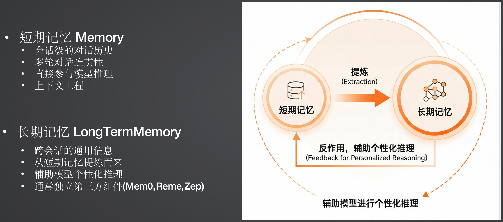

AgentScope中两类记忆的交互模式

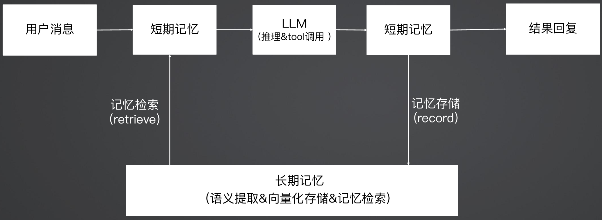

### 5.2 短期记忆：智能上下文管理AutoContextMemory

短期记忆AutoContextMemory：智能上下文管理

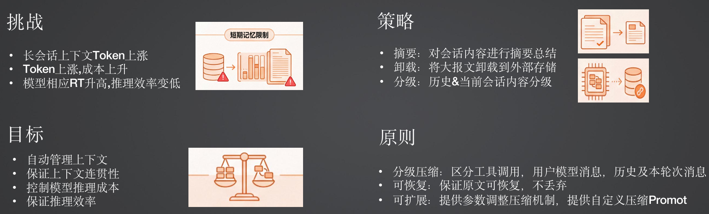

AgentScope中使用AutoContextMemory

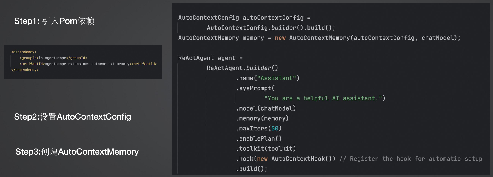

AutoContextConfig的自定义扩展参数

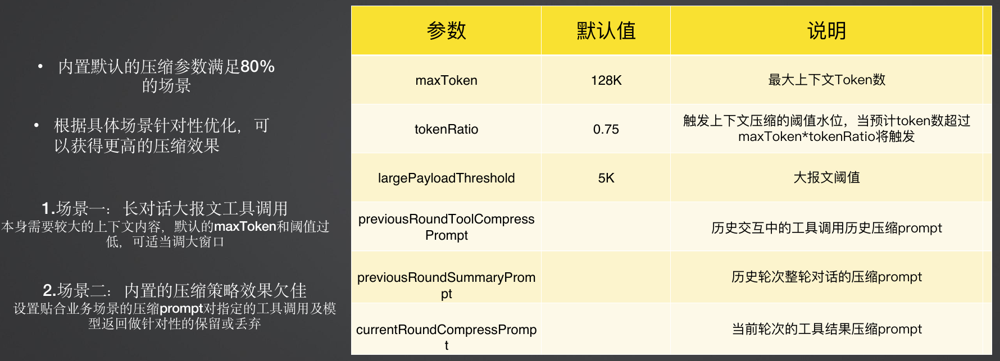

### 5.3 长期记忆：原理介绍及框架集成

长期记忆组件的核心流程

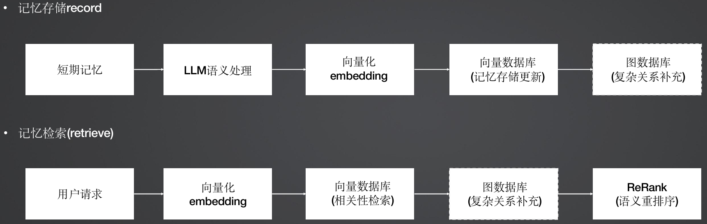

AgentScope接入ReMe

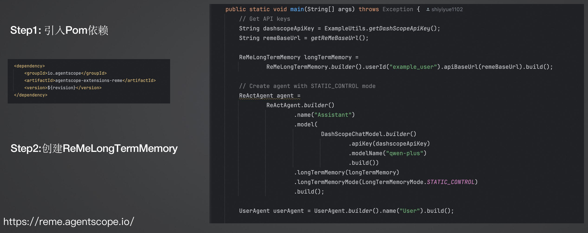

AgentScope接入MemO

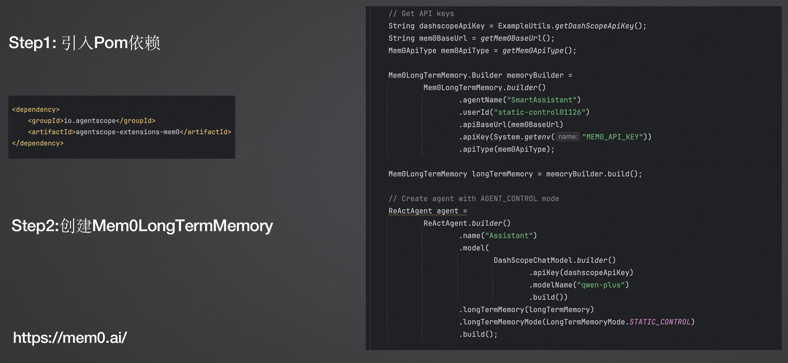

AgentScope自定义LongTermMemory

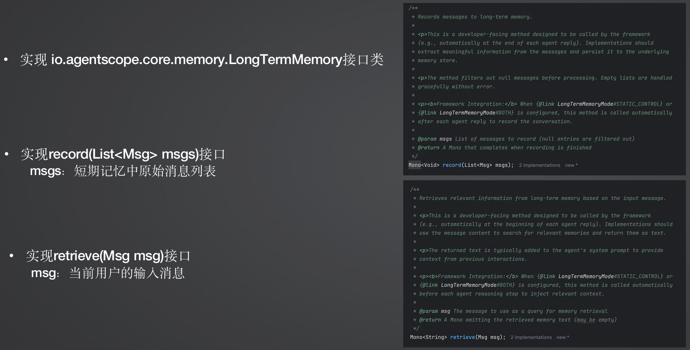

### 5.4 总结

AgentScope中记忆基础：短期记忆和长期记忆的概念及交互模式介绍

AgentScope短期记忆：AutoContextMemory上下文智能管理组件

AgentScope中集成长期记忆组件，ReMe&Mem0

## 6.结构化输出：将 Agent 应用整合到业务系统中的桥梁

让Agent按照预定义的格式输出内容，并将其运用到复杂场景中。

### 6.1 使用简单的结构化Agent 输出

> Agent(Required)需要调用到的Agent
>
> StructClass (Rquired)指定要结构化输出的格式类。

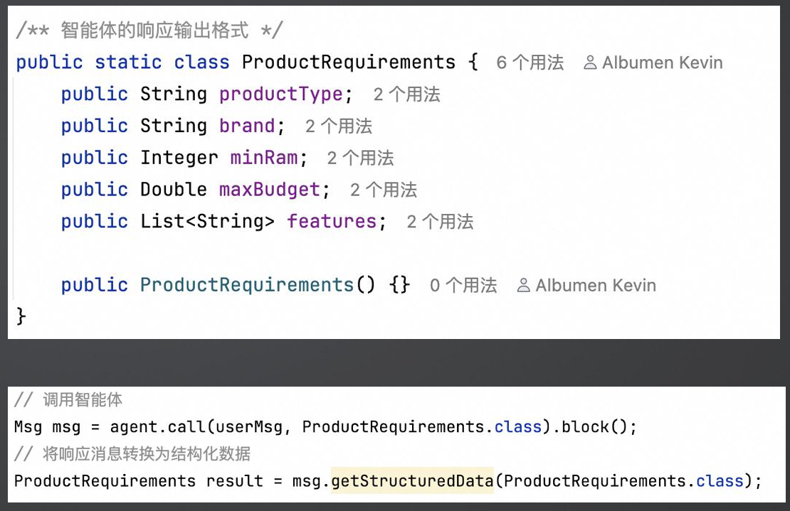

### 6.2 将复杂结构化输出和真实工具调用场景相结合

在真实场景中，Agent往往会调用多种工具，并综合获取到的资料生成结构化的输出，在这里我们以一个“查询2022年。世界杯决赛队伍详情”的示例，指导Agent查找浏览器获取结果，并使用我们指定的嵌套输出结构输出答案。

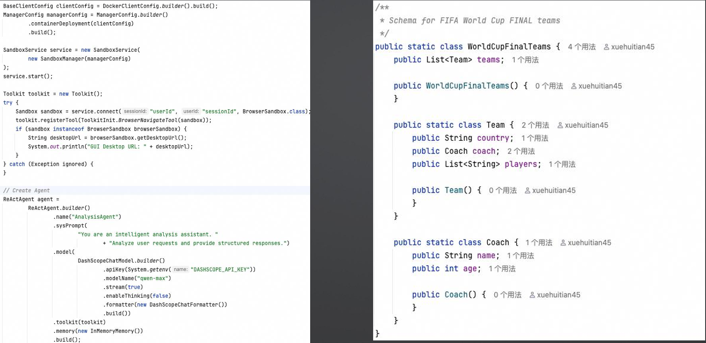

## 7.Agent Scope Java vs Studio

### 7.1 Agent Scope Studio介绍、安装与使用

Agent Scope Studio简单介绍

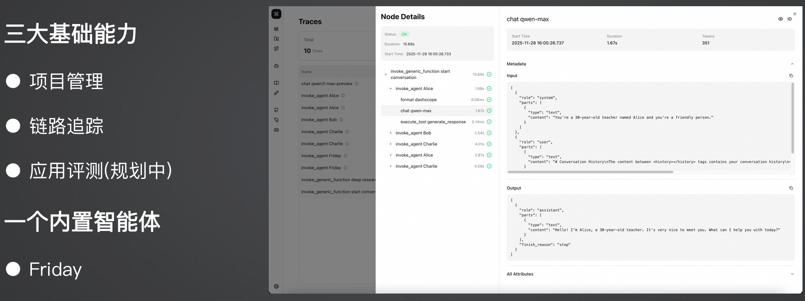

Agent Scope Studio 安装与使用

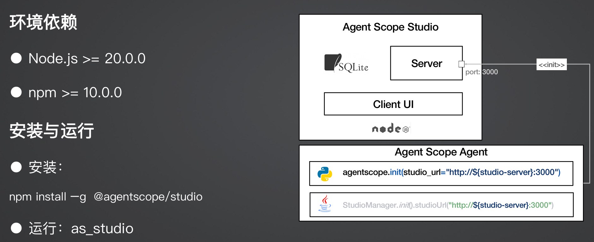

### 7.2 Agent Scope Java在开发形态下 Studio 协作方式

如何在 Java 版本中使用 Agent Studio

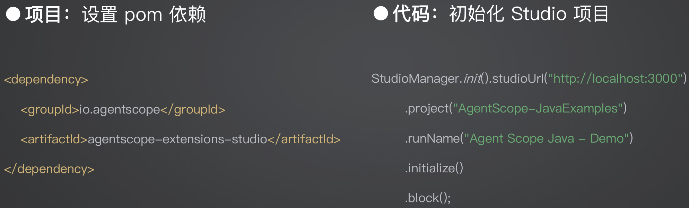

### 7.3 演示

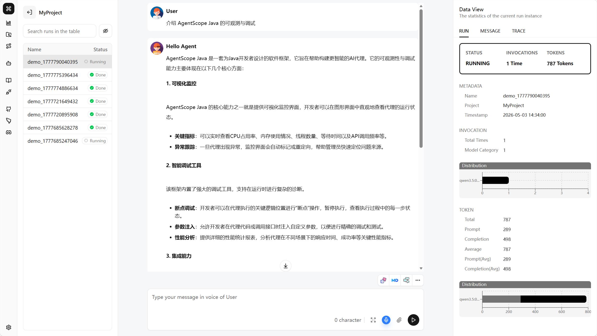

### 7.4 AI可观测系统性介绍

Tracing从微服务到AI应用的演进

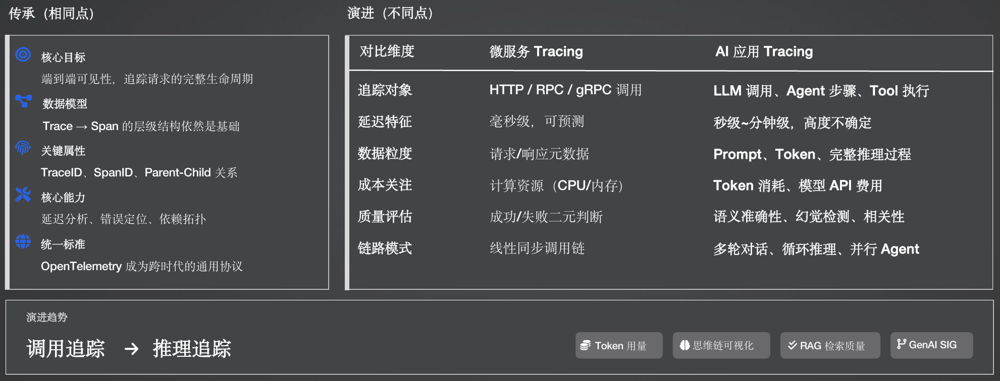

AI可观测的生产环境的解决方案

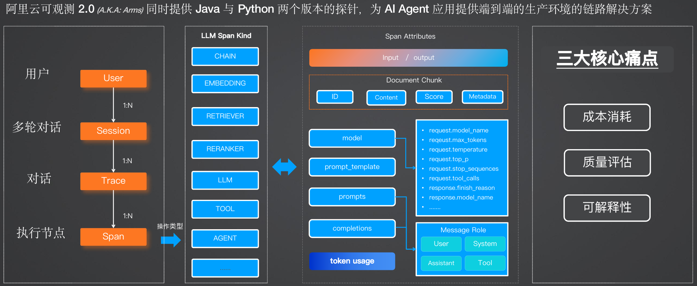

### 7.5 生产环境下的可观测演示

## 8.Plan：让Agent能自主分解复杂任务

通过引入PlanNotebook，Agent能自主分解复杂任务，并提供友好的人类介入能力

### 8.1 PlanNotebook 介绍

为什么要使用 PlanNotebook

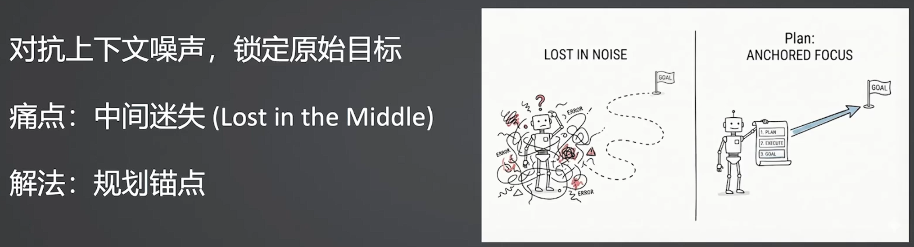

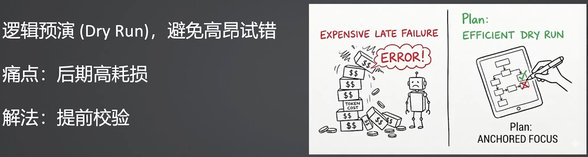

### 8.2 PlanNotebook Example 演示

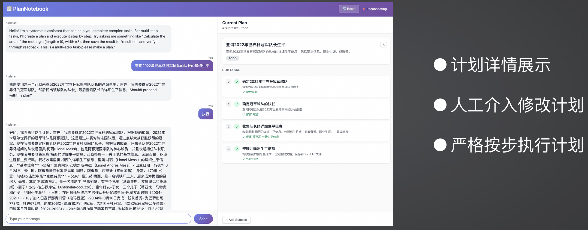

### 8.3 PlanNotebook实现原理

模型通过工具操作PlanNotebook、用户可以直接操作PlanNotebook、PlanNotebook通过hint message 提示模型

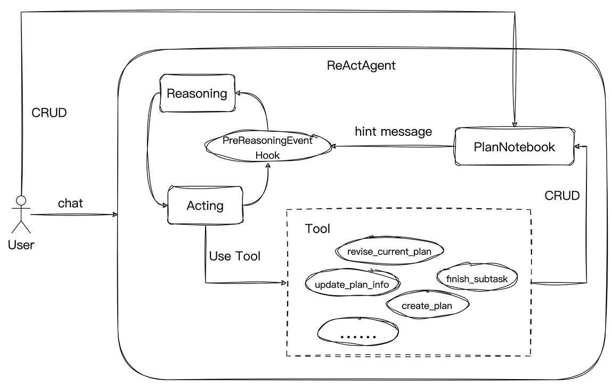

核心类：PlanNotebook。默认的提示实现：DefaultPlanToHint

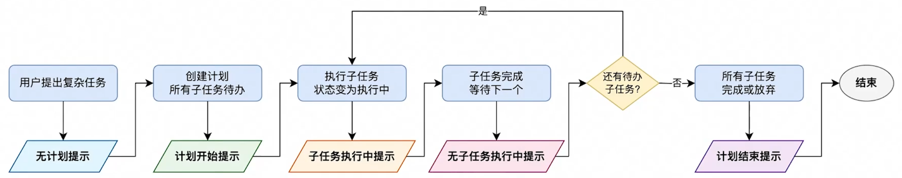

## 9.ToolGroup：帮助模型面对大量Tool时更好地决策

规模化工具调用面临的核心挑战：工具数量激增导致上下文压力增大、模型决策准确率下降及幻觉调用风险上升。

AgentScopeJava的ToolGroup解决方案：通过工具分组与动态激活机制，实现按需暴露、精准决策。

### 9.1 规模化工具调用的挑战与瓶颈


### 9.2 AgentScope Java Tool Group 解决方案


### 9.3 工具分组的创建、注册与动态激活流程


## 10.Agent Debate：以狼人杀为例探讨多Agent系统难点

### 10.1 项目介绍


### 10.2 核心挑战与解决方案

持续思考：如何让Agent持续思考而非一次性回答

信息隔离：如何在公开讨论和私密密谋之间实现信息隔离

多人对话理解：如何让Agent理解多人对话中谁说了什么

决策：如何确保Agent的决策能被程序可靠解析

流程控制：如何让多个Agent按照狼人杀的规则有序地执行

人机交互：如何让人类玩家与AI无缝交互

#### 10.2.1 持续思考—ReAct Agent


#### 10.2.2 信息隔离—MsgHub


#### 10.2.3 多人对话—MultiAgentFormatter


#### 10.2.4 决策明确—Structured Output


#### 10.2.5 流程控制


#### 10.2.6 人机对战—Human in the Loop


#### 10.2.7 总结


## 11.A2A：多Agent分布式对话的桥梁

### 11.1 A2A (Agent2Agent) 简介


### 11.2 在AgentScope Java 中使用 A2A 协议

将ReactAgent暴露为A2A服务


访问远端的A2A服务


### 11.3 通过Nacos进行A2A Agent 的注册与发现

自动注册A2A服务到Nacos上


自动从Nacos发现A2A服务


