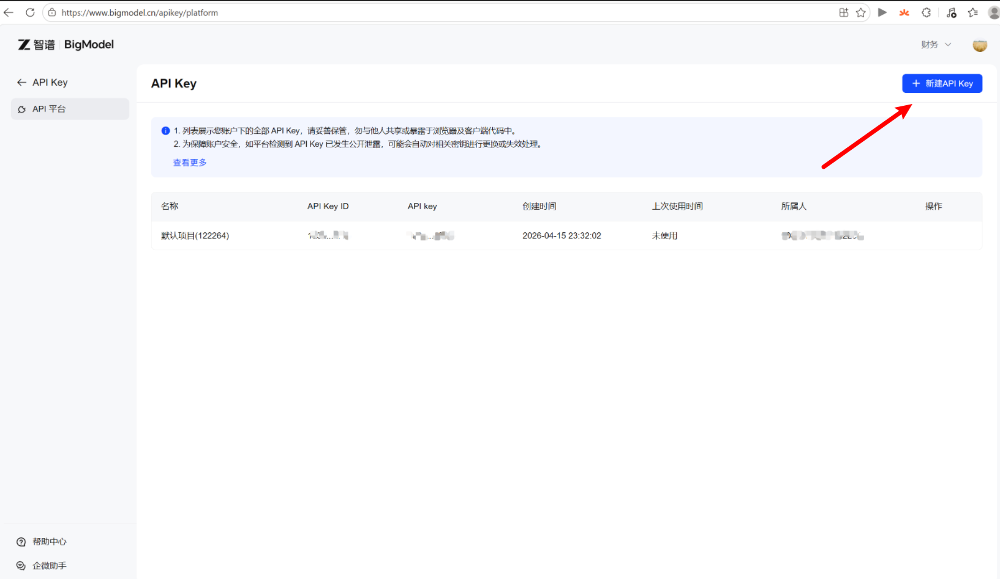
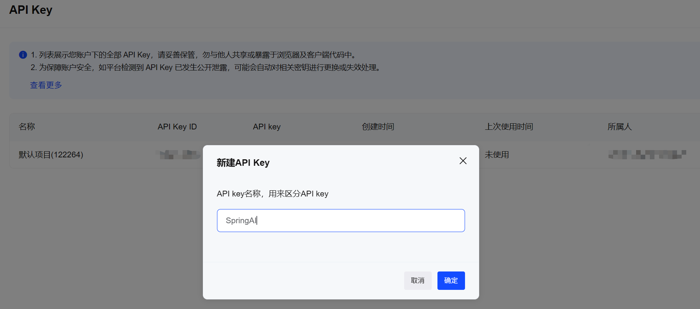
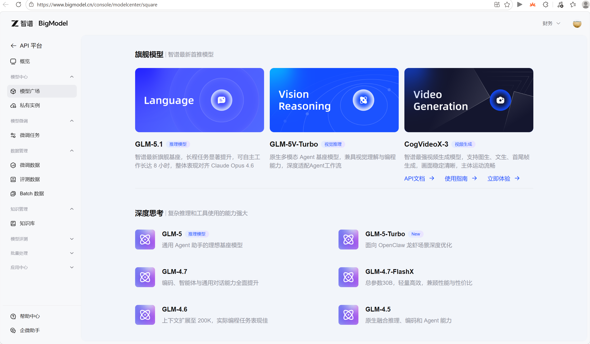
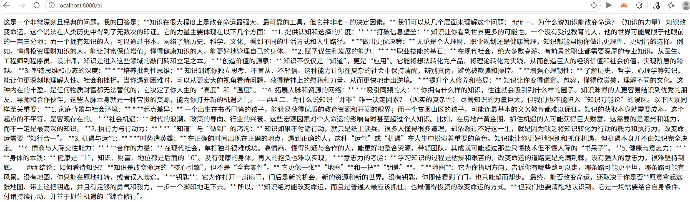

<!-- START doctoc generated TOC please keep comment here to allow auto update -->
<!-- DON'T EDIT THIS SECTION, INSTEAD RE-RUN doctoc TO UPDATE -->
**Table of Contents**  *generated with [DocToc](https://github.com/thlorenz/doctoc)*

- [1. 快速上手](#1-%E5%BF%AB%E9%80%9F%E4%B8%8A%E6%89%8B)
  - [1.1 SpringAI 介绍](#11-springai-%E4%BB%8B%E7%BB%8D)
  - [1.2 申请 API key](#12-%E7%94%B3%E8%AF%B7-api-key)
  - [1.3 查看可用的模型](#13-%E6%9F%A5%E7%9C%8B%E5%8F%AF%E7%94%A8%E7%9A%84%E6%A8%A1%E5%9E%8B)
  - [1.4 创建 Spring Boot 项目](#14-%E5%88%9B%E5%BB%BA-spring-boot-%E9%A1%B9%E7%9B%AE)
  - [1.5 配置依赖管理](#15-%E9%85%8D%E7%BD%AE%E4%BE%9D%E8%B5%96%E7%AE%A1%E7%90%86)
  - [1.6 引入 Spring AI 相关依赖](#16-%E5%BC%95%E5%85%A5-spring-ai-%E7%9B%B8%E5%85%B3%E4%BE%9D%E8%B5%96)
  - [1.7 添加配置文件](#17-%E6%B7%BB%E5%8A%A0%E9%85%8D%E7%BD%AE%E6%96%87%E4%BB%B6)
  - [1.8 使用 Chat Client 完成大模型调用](#18-%E4%BD%BF%E7%94%A8-chat-client-%E5%AE%8C%E6%88%90%E5%A4%A7%E6%A8%A1%E5%9E%8B%E8%B0%83%E7%94%A8)
- [2. 结构化输出](#2-%E7%BB%93%E6%9E%84%E5%8C%96%E8%BE%93%E5%87%BA)
  - [2.1 输出普通对象](#21-%E8%BE%93%E5%87%BA%E6%99%AE%E9%80%9A%E5%AF%B9%E8%B1%A1)
  - [2.2 输出 List 对象](#22-%E8%BE%93%E5%87%BA-list-%E5%AF%B9%E8%B1%A1)
- [3. 流式响应](#3-%E6%B5%81%E5%BC%8F%E5%93%8D%E5%BA%94)
  - [3.1 核心概念](#31-%E6%A0%B8%E5%BF%83%E6%A6%82%E5%BF%B5)
  - [3.2 技术实现](#32-%E6%8A%80%E6%9C%AF%E5%AE%9E%E7%8E%B0)
- [4. 提示词模板（PromptTemplate）](#4-%E6%8F%90%E7%A4%BA%E8%AF%8D%E6%A8%A1%E6%9D%BFprompttemplate)
  - [4.1 基本概念](#41-%E5%9F%BA%E6%9C%AC%E6%A6%82%E5%BF%B5)
  - [4.2 实际场景](#42-%E5%AE%9E%E9%99%85%E5%9C%BA%E6%99%AF)
  - [4.3 代码演示](#43-%E4%BB%A3%E7%A0%81%E6%BC%94%E7%A4%BA)
- [5. 多厂商多模型自定义配置](#5-%E5%A4%9A%E5%8E%82%E5%95%86%E5%A4%9A%E6%A8%A1%E5%9E%8B%E8%87%AA%E5%AE%9A%E4%B9%89%E9%85%8D%E7%BD%AE)
- [6. 会话保持(Chat memory)](#6-%E4%BC%9A%E8%AF%9D%E4%BF%9D%E6%8C%81chat-memory)
  - [6.1 介绍](#61-%E4%BB%8B%E7%BB%8D)
  - [6.2 代码示例](#62-%E4%BB%A3%E7%A0%81%E7%A4%BA%E4%BE%8B)
- [7. 工具调用（function calling）](#7-%E5%B7%A5%E5%85%B7%E8%B0%83%E7%94%A8function-calling)
  - [7.1 介绍](#71-%E4%BB%8B%E7%BB%8D)
  - [7.2 代码示例](#72-%E4%BB%A3%E7%A0%81%E7%A4%BA%E4%BE%8B)
- [8. MCP 集成(client+server)](#8-mcp-%E9%9B%86%E6%88%90clientserver)
  - [8.1 介绍](#81-%E4%BB%8B%E7%BB%8D)
  - [8.2 代码示例](#82-%E4%BB%A3%E7%A0%81%E7%A4%BA%E4%BE%8B)
  - [8.3 集成 MCP Server](#83-%E9%9B%86%E6%88%90-mcp-server)
  - [8.4 集成 MCP Client](#84-%E9%9B%86%E6%88%90-mcp-client)
- [9. 集成RAG](#9-%E9%9B%86%E6%88%90rag)
  - [9.1 介绍](#91-%E4%BB%8B%E7%BB%8D)
  - [9.2 核心逻辑](#92-%E6%A0%B8%E5%BF%83%E9%80%BB%E8%BE%91)
  - [9.3 关键组件与优势](#93-%E5%85%B3%E9%94%AE%E7%BB%84%E4%BB%B6%E4%B8%8E%E4%BC%98%E5%8A%BF)
  - [9.4 一句话总结](#94-%E4%B8%80%E5%8F%A5%E8%AF%9D%E6%80%BB%E7%BB%93)
  - [9.5 代码示例](#95-%E4%BB%A3%E7%A0%81%E7%A4%BA%E4%BE%8B)
  - [9.6 安装向量库 Chroma](#96-%E5%AE%89%E8%A3%85%E5%90%91%E9%87%8F%E5%BA%93-chroma)
  - [9.7 引入相关依赖](#97-%E5%BC%95%E5%85%A5%E7%9B%B8%E5%85%B3%E4%BE%9D%E8%B5%96)
  - [9.8 代码集成](#98-%E4%BB%A3%E7%A0%81%E9%9B%86%E6%88%90)

<!-- END doctoc generated TOC please keep comment here to allow auto update -->

> 本文档案例位于`SA-01-SpringAI-Primary`模块和`SA-01-SpringAI-Primary-MCP-Server`模块。安装并启动 向量库Chroma，然后依次启动`SA-01-SpringAI-Primary-MCP-Server`模块、`SA-01-SpringAI-Primary`模块，即可运行案例程序

## 1. 快速上手

### 1.1 SpringAI 介绍

- **模型集成**：支持 OpenAI、Hugging Face 等主流 AI 服务，轻松切换不同大模型（如 GPT-4、Llama 2、Deepseek 等）
- **向量数据库**：集成 Pinecone、Chroma 等向量数据库，支持语义搜索与相似度匹配
- **文档处理**：自动解析 PDF、Markdown 等文档，提取文本内容生成向量嵌入
- **对话记忆**：内置对话历史管理，支持上下文感知的多轮对话
- **工具调用**：通过 @Tool 注解快速集成外部 API（如天气查询、数据库操作）
- **优化求解**：集成 Timefold Solver 解决资源调度等优化问题
- **可观测性**：提供指标监控（延迟、Token 消耗）和日志追踪
- **代理模式**：支持工作流驱动和自主决策两种代理模式，实现复杂任务自动化
- **MCP**：支持 MCP 客户端和 MCP 服务端

### 1.2 申请 API key

- 登录智谱 AI 开放平台：https://www.bigmodel.cn/usercenter/proj-mgmt/apikeys
- 点击创建新的 API Key



- 设置key名称



- 复制创建的API Key，后续会用到

### 1.3 查看可用的模型

- 点击链接跳转 https://www.bigmodel.cn/console/modelcenter/square，后续从这里找模型



### 1.4 创建 Spring Boot 项目

- 创建项目之后，引入依赖

### 1.5 配置依赖管理

```xml
    <properties>
        <project.build.sourceEncoding>UTF-8</project.build.sourceEncoding>
        <java.version>17</java.version>
        <maven.compiler.release>17</maven.compiler.release>
        <maven.compiler.source>17</maven.compiler.source>
        <maven.compiler.target>17</maven.compiler.target>
        <spring-boot.version>3.5.7</spring-boot.version>
        <spring-ai.version>1.0.0</spring-ai.version>
    </properties>
    <dependencyManagement>
        <dependencies>
            <!-- Spring Boot 官方依赖版本管理（统一常用基础组件版本） -->
            <dependency>
                <groupId>org.springframework.boot</groupId>
                <artifactId>spring-boot-dependencies</artifactId>
                <version>${spring-boot.version}</version>
                <type>pom</type>
                <scope>import</scope>
            </dependency>
            <!-- Spring AI 官方 BOM（统一 Spring AI 生态依赖版本） -->
            <dependency>
                <groupId>org.springframework.ai</groupId>
                <artifactId>spring-ai-bom</artifactId>
                <version>${spring-ai.version}</version>
                <type>pom</type>
                <scope>import</scope>
            </dependency>
        </dependencies>
    </dependencyManagement>
```

### 1.6 引入 Spring AI 相关依赖

```xml
    <dependencies>
        <!-- Web 应用基础能力：Spring MVC + 内嵌 Tomcat -->
        <dependency>
            <groupId>org.springframework.boot</groupId>
            <artifactId>spring-boot-starter-web</artifactId>
        </dependency>

        <!-- 接入智谱 AI 模型（ChatModel 自动装配） -->
        <dependency>
            <groupId>org.springframework.ai</groupId>
            <artifactId>spring-ai-starter-model-zhipuai</artifactId>
        </dependency>

    </dependencies>
```

### 1.7 添加配置文件

`src/main/resources/application.yml`

```yaml
server:
  port: 8080
spring:
  application:
    name: SA-01-SpringAI-Primary
  ai:
    zhipuai:
      api-key: ${ZHIPUAI_API_KEY}
```

在 Windows 11 里设置环境变量（系统/用户级）

```bash
图形界面：「设置」→「系统」→「关于」→「高级系统设置」→「环境变量」→ 在「用户变量」或「系统变量」中「新建」
变量名： ZHIPUAI_API_KEY（必须和 application.yml 里一致）
变量值： 在智谱控制台复制的 API Key
重启系统
```

到这一步基本工作已经完成

### 1.8 使用 Chat Client 完成大模型调用

在调用过程中，我们需要使用 spring ai 的 chat client 和 chat model。

```java
package com.action.springai.sa01springaiprimary.controller;

import org.springframework.ai.chat.client.ChatClient;
import org.springframework.ai.chat.model.ChatModel;
import org.springframework.web.bind.annotation.GetMapping;
import org.springframework.web.bind.annotation.RequestParam;
import org.springframework.web.bind.annotation.RestController;

@RestController
public class QuickStartAiController {

    private final ChatModel zhiPuAiChatModel;

    public QuickStartAiController(ChatModel zhiPuAiChatModel) {
        this.zhiPuAiChatModel = zhiPuAiChatModel;
    }

    @GetMapping("/ai")
    public String generation(@RequestParam(name = "userInput", defaultValue = "你觉得知识能改变命运么？") String userInput) {
        ChatClient chatClient = ChatClient.create(zhiPuAiChatModel);
        return chatClient.prompt(userInput).call().content();
    }
}
```

- 请求 API：`http://localhost:8080/ai`，得到相应结果

```bash
GET http://localhost:8080/ai
```



到这里已经完成了SpringAl与大模型交互的第一步，接下来探索更多SpringAl提供的能力。

## 2. 结构化输出

在实际业务场景中，除了直接返回文本结果，通常还需要让大模型按固定结构输出，方便程序直接处理。

结构化输出常见优势：

- 输出格式稳定，便于后端解析
- 便于与数据库、接口对象进行映射
- 更适合做字段校验和业务编排
- 减少后处理字符串带来的不确定性

Spring AI 的结构化输出功能可将大模型的自由文本响应，自动转换为 Java 对象（如 POJO、Map），作用包括：

1. **避免手动解析**：直接返回 POJO
2. **类型安全**：IDE 自动补全，减少拼写错误
3. **简化集成**：直接存入数据库或作为 API 响应返回
4. **减少错误**：统一格式校验，避免格式不匹配问题

程序正常使用的都是 JSON 结构，期望大模型返回 JSON 结构，然后由 Spring AI 返回实体，这样就不需要再次转换就能直接使用

### 2.1 输出普通对象

在前面使用 `ChatClient` 调用时，是直接调用 `content` 拿到结果字符串。为了能够获取完整的结构对象，可以调用
`entity(User.class);` 用来返回 `User` 对象，而不是字符串。

可以通过 `ChatClient` 的实体映射能力，将模型返回结果直接转换为 Java 对象：

`StructuredOutputAiController.java`：

```java
package com.action.springai.sa01springaiprimary.controller;

import com.action.springai.sa01springaiprimary.entity.User;
import org.springframework.ai.chat.client.ChatClient;
import org.springframework.ai.chat.model.ChatModel;
import org.springframework.web.bind.annotation.GetMapping;
import org.springframework.web.bind.annotation.RequestParam;
import org.springframework.web.bind.annotation.RestController;

@RestController
public class StructuredOutputAiController {

    private final ChatModel zhiPuAiChatModel;

    public StructuredOutputAiController(ChatModel zhiPuAiChatModel) {
        this.zhiPuAiChatModel = zhiPuAiChatModel;
    }

    @GetMapping("/ai/json")
    public Object generationJson(@RequestParam(name = "userInput", defaultValue = "随机生成一份用户信息") String userInput) {
        ChatClient zpChatClient = ChatClient.create(zhiPuAiChatModel);
        User zpContent = zpChatClient.prompt(userInput).call().entity(User.class);
        return zpContent;
    }
}
```

请求 API：`http://localhost:8080/ai/json`，得到结构化 JSON 结果。示例返回（JSON）：

```
GET http://localhost:8080/ai/json
```

```json
{
  "name": "张三",
  "age": "23",
  "sex": "男"
}
```

这些都是基本对象，那如果想返回 list 呢，这个 `entity` 好像满足不了啊，放心，Spring AI 都帮你准备好了。

### 2.2 输出 List 对象

```java
package com.action.springai.sa01springaiprimary.controller;

import java.util.List;

import com.action.springai.sa01springaiprimary.entity.User;
import org.springframework.ai.chat.client.ChatClient;
import org.springframework.ai.chat.model.ChatModel;
import org.springframework.core.ParameterizedTypeReference;
import org.springframework.web.bind.annotation.GetMapping;
import org.springframework.web.bind.annotation.RequestParam;
import org.springframework.web.bind.annotation.RestController;

@RestController
public class StructuredOutputAiController {

    private final ChatModel zhiPuAiChatModel;

    public StructuredOutputAiController(ChatModel zhiPuAiChatModel) {
        this.zhiPuAiChatModel = zhiPuAiChatModel;
    }

    @GetMapping("/ai/json/list")
    public Object generationJsonList(
            @RequestParam(name = "userInput", defaultValue = "随机生成3条用户信息") String userInput) {
        ChatClient zpChatClient = ChatClient.create(zhiPuAiChatModel);
        List<User> zpContent = zpChatClient.prompt(userInput)
                .call().entity(new ParameterizedTypeReference<List<User>>() {
                });
        return zpContent;
    }
}
```

```
GET http://localhost:8080/ai/json/list
```

```json
[
  {
    "name": "张伟",
    "age": "25",
    "sex": "男"
  },
  {
    "name": "李娜",
    "age": "32",
    "sex": "女"
  },
  {
    "name": "王芳",
    "age": "18",
    "sex": "女"
  }
]
```

请求 API：`http://localhost:8080/ai/json/list`，通过查询参数传入 `userInput`（例如让模型「随机生成 3 条用户信息」），得到 JSON 数组形式的 `List<User>`。

## 3. 流式响应

Spring AI 的流式响应能力可以让大模型的输出以增量、实时的方式返回给客户端，而不必等整段内容生成完毕再一次性返回。这在长文本生成、对话式交互等场景下能明显改善体验。

### 3.1 核心概念

1. **普通响应与流式响应**

- **普通**：客户端发起请求 → 等待完整内容生成 → 一次性收到全部结果。
- **流式**：客户端发起请求 → **实时**收到片段（逐字、逐句等）→ 持续处理直至结束。

2. **适用场景**

- 长文本生成（文章、代码、报告等）
- 聊天机器人对话（打字机效果）
- 实时数据分析与可视化
- 需要尽快给出反馈的交互系统

### 3.2 技术实现

Spring AI 通过 **Reactor Flux** 和 **Server-Sent Events（SSE）** 实现流式响应：

```java
package com.action.springai.sa01springaiprimary.controller;

import java.nio.charset.StandardCharsets;

import org.springframework.ai.chat.client.ChatClient;
import org.springframework.ai.chat.client.advisor.SimpleLoggerAdvisor;
import org.springframework.ai.chat.model.ChatModel;
import org.springframework.http.MediaType;
import org.springframework.http.ResponseEntity;
import org.springframework.web.bind.annotation.GetMapping;
import org.springframework.web.bind.annotation.RequestParam;
import org.springframework.web.bind.annotation.RestController;

import reactor.core.publisher.Flux;

@RestController
public class StreamAiController {

    private final ChatModel zhiPuAiChatModel;

    public StreamAiController(ChatModel zhiPuAiChatModel) {
        this.zhiPuAiChatModel = zhiPuAiChatModel;
    }

    /**
     * 使用带 UTF-8 charset 的 MediaType，并通过 ResponseEntity 显式声明 Content-Type，
     * 避免 SSE 流被按 ISO-8859-1 写出导致中文乱码。
     */
    private static final MediaType TEXT_EVENT_STREAM_UTF8 =
            new MediaType("text", "event-stream", StandardCharsets.UTF_8);

    @GetMapping("/ai/stream")
    public ResponseEntity<Flux<String>> streamContent(
            @RequestParam(defaultValue = "和我说一个长笑话") String userInput) {
        // Create ChatClient instances programmatically
        ChatClient zpChatClient = ChatClient.create(zhiPuAiChatModel);
        Flux<String> content = zpChatClient.prompt(userInput)
                .advisors(new SimpleLoggerAdvisor())
                .stream().content();
        return ResponseEntity.ok()
                .contentType(TEXT_EVENT_STREAM_UTF8)
                .body(content);
    }
}
```

`src/main/resources/application.yml`

```yaml
server:
  port: 8080
  servlet:
    encoding:
      charset: UTF-8
      enabled: true
      force: true
```

测试：

```
GET http://localhost:8080/ai/stream
```

## 4. 提示词模板（PromptTemplate）

### 4.1 基本概念

在人工智能领域，Prompt（提示词）是与大语言模型（LLM）交互的关键输入，它决定了模型输出的内容和方向。而
PromptTemplate（提示词模板）则是一种结构化设计提示词的工具，它通过定义可替换的变量和固定的文本结构，使提示词能够灵活适应不同的输入场景。
在 Spring AI 框架中，PromptTemplate 是处理提示词工程的核心组件之一，它允许开发者以模块化、可复用的方式构建提示词，提升与 LLM
交互的效率和可控性。

### 4.2 实际场景

1. 智能问答系统

   模板："根据以下文档内容，回答用户问题：{question}。文档内容：{document}"

   优势：将用户问题与上下文文档分离，便于更换不同文档或问题。

2. 文本摘要生成

   模板："请为以下文本生成摘要，要求不超过200字：{text}"

   应用：批量处理不同文本时，只需传入 text 变量。

3. 代码生成辅助

   模板："根据需求生成Java代码：{requirement}。注意使用Spring框架，示例格式如下：\n java\n{example}\n "

   扩展：通过变量 example 传入代码示例，引导模型生成符合规范的代码。

### 4.3 代码演示

```java
package com.action.springai.sa01springaiprimary.controller;

import java.util.Map;

import org.springframework.ai.chat.client.ChatClient;
import org.springframework.ai.chat.client.advisor.SimpleLoggerAdvisor;
import org.springframework.ai.chat.model.ChatModel;
import org.springframework.web.bind.annotation.GetMapping;
import org.springframework.web.bind.annotation.RequestParam;
import org.springframework.web.bind.annotation.RestController;

@RestController
public class PromptTemplateAiController {

    private final ChatModel zhiPuAiChatModel;

    public PromptTemplateAiController(ChatModel zhiPuAiChatModel) {
        this.zhiPuAiChatModel = zhiPuAiChatModel;
    }

    @GetMapping("/ai/prompt/template")
    public Object promptTemplate(@RequestParam(name = "username", defaultValue = "张三") String username) {
        // Create ChatClient instances programmatically
        ChatClient zpChatClient = ChatClient.create(zhiPuAiChatModel);
        return zpChatClient.prompt()
                .user(u -> u.text("请帮我写一首诗，作者是{userName}，内容围绕作者的名字去写")
                        .param("userName", username))
                .advisors(new SimpleLoggerAdvisor())
                .call().content();
    }

    @GetMapping("/ai/prompt/template/map")
    public Object promptTemplateByMap(@RequestParam(name = "username", defaultValue = "张三") String username) {
        // Create ChatClient instances programmatically
        ChatClient zpChatClient = ChatClient.create(zhiPuAiChatModel);
        return zpChatClient.prompt()
                .user(u -> u.text("请帮我写一首诗，作者是{userName}，内容围绕作者的名字去写")
                        .params(Map.of("userName", username)))
                .advisors(new SimpleLoggerAdvisor())
                .call().content();
    }
}
```

测试：

```
GET http://localhost:8080/ai/prompt/template?username="李白"
```

```bash
默认参数：
http://localhost:8080/ai/prompt/template
指定作者名：
http://localhost:8080/ai/prompt/template?username=李白
Map 变量写法：
http://localhost:8080/ai/prompt/template/map?username=李白
```

## 5. 多厂商多模型自定义配置

在前面的示例中，我们一次只能使用一种模型，虽然能同时使用多个厂商的模型，但是还是无法解决我还想用一个厂商模型，但是我想用这个厂商的不同模型的问题，那么我们如何解决呢？这里给了一个解决方案，帮你实现。

添加多模型依赖示例

```xml
<dependency>
    <groupId>org.springframework.ai</groupId>
    <artifactId>spring-ai-starter-model-deepseek</artifactId>
</dependency>
```

配置多厂商 key

```yaml
server:
  port: 8080
spring:
  ai:
    deepseek:
      api-key: 你的DeepSeek_API_Key
    zhipuai:
      api-key: 你的ZhiPu_API_Key
```

定义两个 ChatClient Bean（同厂商不同模型）

```java
package com.action.springai.sa01springaiprimary.config;

import org.springframework.ai.chat.client.ChatClient;
import org.springframework.ai.chat.model.ChatModel;
import org.springframework.ai.zhipuai.ZhiPuAiChatOptions;
import org.springframework.ai.zhipuai.ZhiPuAiChatModel;
import org.springframework.ai.zhipuai.api.ZhiPuAiApi;
import org.springframework.beans.factory.annotation.Value;
import org.springframework.context.annotation.Bean;
import org.springframework.context.annotation.Configuration;

@Configuration
public class MultiModelConfiguration {

    @Value("${spring.ai.zhipuai.api-key}")
    private String zpAPIKey;

    @Bean
    public ChatClient zpChatGlm4vFlashClient() {
        ZhiPuAiApi zhiPuAiApi = new ZhiPuAiApi(zpAPIKey);
        ZhiPuAiChatOptions options = ZhiPuAiChatOptions.builder().model("glm-4v-flash").build();
        ChatModel zhiPuAiChatModel = new ZhiPuAiChatModel(zhiPuAiApi, options);
        return ChatClient.create(zhiPuAiChatModel);
    }

    @Bean
    public ChatClient zpChatGlm4PlusClient() {
        ZhiPuAiApi zhiPuAiApi = new ZhiPuAiApi(zpAPIKey);
        ZhiPuAiChatOptions options = ZhiPuAiChatOptions.builder().model("glm-4-plus").build();
        ChatModel zhiPuAiChatModel = new ZhiPuAiChatModel(zhiPuAiApi, options);
        return ChatClient.create(zhiPuAiChatModel);
    }
}
```

只需要定义这两个 bean，自定义两个 ChatClient，每个 chat 里面引入对应的 model 即可，那么如何使用呢？

首先在 controller 中注入这两个依赖：

```java
private final ChatClient zpChatGlm4vFlashClient;
private final ChatClient zpChatGlm4PlusClient;
```

然后直接在代码中调用：

```java
package com.action.springai.sa01springaiprimary.controller;

import org.springframework.ai.chat.client.ChatClient;
import org.springframework.beans.factory.annotation.Autowired;
import org.springframework.web.bind.annotation.GetMapping;
import org.springframework.web.bind.annotation.RequestParam;
import org.springframework.web.bind.annotation.RestController;

@RestController
public class MultiModelAiController {

    @Autowired
    private ChatClient zpChatGlm4vFlashClient;

    @Autowired
    private ChatClient zpChatGlm4PlusClient;

    @GetMapping("/ai/client/configuration/model1")
    public Object clientConfiguration1(
            @RequestParam(defaultValue = "详细介绍你是什么AI模型？具体版本是什么？") String userInput) {
        return zpChatGlm4PlusClient.prompt(userInput)
                .call().content();
    }

    @GetMapping("/ai/client/configuration/model2")
    public Object clientConfiguration2(
            @RequestParam(defaultValue = "详细介绍你是什么AI模型？具体版本是什么？") String userInput) {
        return zpChatGlm4vFlashClient.prompt(userInput)
                .call().content();
    }
}
```

测试：

```bash
http://localhost:8080/ai/client/configuration/model1
http://localhost:8080/ai/client/configuration/model2
```

## 6. 会话保持(Chat memory)

ChatMemory 是 Spring AI 中管理对话上下文的核心组件，主要作用是存储用户与 AI 的交互历史，让大语言模型（LLM）能“记住”对话内容，实现有上下文感知的交互。

### 6.1 介绍

核心功能：

1. 保存对话历史：记录用户提问和 AI 回复，避免多轮对话中信息丢失。
2. 上下文注入：在调用模型时自动拼接历史对话，让 AI 理解当前问题的语境。
3. 会话隔离：通过会话 ID 区分不同用户的对话，支持多用户场景。

应用场景：

- 多轮对话（如客服咨询、任务拆解）：让 AI 连贯响应后续问题。
- 个性化交互：记住用户偏好（如语言风格、历史需求），提供定制化服务。
- 状态管理（如流程引导、表单填写）：存储中间步骤信息，避免重复输入。

核心特性：

- 支持内存、Redis 等多种存储方式，适配不同场景。
- 可控制上下文长度，避免超出模型 token 限制。

### 6.2 代码示例

`ChatMemoryConfiguration.java`

```java
package com.action.springai.sa01springaiprimary.config;

import org.springframework.ai.chat.memory.ChatMemory;
import org.springframework.ai.chat.memory.MessageWindowChatMemory;
import org.springframework.context.annotation.Bean;
import org.springframework.context.annotation.Configuration;

@Configuration
public class ChatMemoryConfiguration {

    @Bean
    public ChatMemory chatMemory() {
        return MessageWindowChatMemory.builder()
                .build();
    }
}
```

`ChatMemoryAiController.java`：

```java
package com.action.springai.sa01springaiprimary.controller;

import org.springframework.ai.chat.client.ChatClient;
import org.springframework.ai.chat.client.advisor.MessageChatMemoryAdvisor;
import org.springframework.ai.chat.client.advisor.SimpleLoggerAdvisor;
import org.springframework.ai.chat.memory.ChatMemory;
import org.springframework.ai.chat.model.ChatModel;
import org.springframework.beans.factory.annotation.Autowired;
import org.springframework.web.bind.annotation.GetMapping;
import org.springframework.web.bind.annotation.RequestParam;
import org.springframework.web.bind.annotation.RestController;

@RestController
public class ChatMemoryAiController {

    @Autowired
    private ChatMemory chatMemory;

    @Autowired
    private ChatModel zhiPuAiChatModel;

    @GetMapping("/ai/chat/memory")
    public Object chatMemory(
            @RequestParam(defaultValue = "你好，先记住我的名字叫张三") String userInput,
            @RequestParam(defaultValue = "conversationId") String conversationId) {
        // Create ChatClient instances programmatically
        ChatClient zpChatClient = ChatClient.create(zhiPuAiChatModel);
        return zpChatClient.prompt(userInput)
                .advisors(new SimpleLoggerAdvisor(), MessageChatMemoryAdvisor.builder(chatMemory).build())
                .advisors(a -> a.param(ChatMemory.CONVERSATION_ID, conversationId))
                .call().content();
    }
}
```

测试：

```bash
第一次请求（建立记忆）：
http://localhost:8080/ai/chat/memory?userInput=我叫李雷&conversationId=u1001

第二次请求（同会话验证记忆）：
http://localhost:8080/ai/chat/memory?userInput=你还记得我叫什么吗&conversationId=u1001

第三次请求（新会话隔离）：
http://localhost:8080/ai/chat/memory?userInput=你还记得我叫什么吗&conversationId=u2002
```

## 7. 工具调用（function calling）

Function Calling 是 Spring AI 中连接大语言模型（LLM）与外部工具的核心机制，允许 AI 在对话过程中自动调用预设工具（如数据库、API、计算器等）获取实时数据或执行操作，从而提升回答的准确性和实用性。

### 7.1 介绍

核心作用

1. 突破模型能力限制：让 AI 能访问模型本身不具备的实时数据（如天气、股票）或专业功能（如计算、文件处理）。
2. 保证信息准确性：通过调用可靠工具，减少模型“幻觉”（虚构错误信息）的问题。
3. 结构化交互流程：AI 生成符合规范的工具调用指令（如 JSON 格式），便于程序解析和执行。

工作流程

1. 定义工具能力：提前告知 AI 有哪些工具可用（如“查询天气”“计算汇率”）及工具的使用规则。
2. 对话中触发调用：当用户问题需要外部数据（如“北京今天气温”），AI 自动判断并生成工具调用请求。
3. 工具执行与结果回传：Spring AI 执行工具调用（如调用天气 API），将结果返回给 AI 用于生成最终回答。

核心组件

- 工具描述：定义工具的名称、参数和功能，让 AI 理解何时及如何调用。
- 调用处理器：负责解析 AI 生成的调用指令，执行实际工具操作，并将结果反馈给模型。

应用场景

- 实时信息查询：调用 API 获取天气、新闻、航班等动态数据。
- 企业系统集成：连接 CRM、OA 等系统，实现 AI 驱动的工单创建、数据查询。
- 数据处理任务：使用计算器、格式转换器等工具处理用户输入（如单位换算、文本格式化）。

优势

- 无缝集成 Spring 生态：可直接调用 Spring 管理的服务（如 Bean）作为工具，适配企业级开发。
- 动态能力扩展：通过添加新工具，无需修改模型即可让 AI 获得更多功能。
- 可控的交互逻辑：通过预设工具规则，避免 AI 执行无意义或危险操作。

### 7.2 代码示例

定义包含两个 tool 的类

```java
    static class DateTimeTools {

        @Tool(description = "获取当前时间")
        String getCurrentDateTime() {
            return LocalDateTime.now()
                    .atZone(LocaleContextHolder.getTimeZone().toZoneId())
                    .toString();
        }

        @Tool(description = "获取用户的生日，入参是用户名，出参是年月日 如 1994年1月1日")
        String getBirthdayDate(String userName) {
            if ("张三".equals(userName)) {
                return "1994年8月29日";
            } else if ("李斯".equals(userName)) {
                return "1994年4月29日";
            } else {
                return "没有这个人的信息";
            }
        }
    }
```

在代码中引用这个 tools

```java
package com.action.springai.sa01springaiprimary.controller;

import java.time.LocalDateTime;

import org.springframework.ai.chat.client.ChatClient;
import org.springframework.ai.chat.client.advisor.SimpleLoggerAdvisor;
import org.springframework.ai.chat.model.ChatModel;
import org.springframework.ai.tool.annotation.Tool;
import org.springframework.beans.factory.annotation.Autowired;
import org.springframework.context.i18n.LocaleContextHolder;
import org.springframework.web.bind.annotation.GetMapping;
import org.springframework.web.bind.annotation.RequestParam;
import org.springframework.web.bind.annotation.RestController;

@RestController
public class FunctionCallingAiController {

    @Autowired
    private ChatModel zhiPuAiChatModel;

    static class DateTimeTools {

        @Tool(description = "获取当前时间")
        String getCurrentDateTime() {
            return LocalDateTime.now()
                    .atZone(LocaleContextHolder.getTimeZone().toZoneId())
                    .toString();
        }

        @Tool(description = "获取用户的生日，入参是用户名，出参是年月日 如 1994年1月1日")
        String getBirthdayDate(String userName) {
            if ("张三".equals(userName)) {
                return "1994年8月29日";
            } else if ("李斯".equals(userName)) {
                return "1994年4月29日";
            } else {
                return "没有这个人的信息";
            }
        }
    }

    @GetMapping("/ai/tools")
    public Object tools(@RequestParam(defaultValue = "下周五是几号") String userInput) {
        // Create ChatClient instances programmatically
        ChatClient zpChatClient = ChatClient.create(zhiPuAiChatModel);
        return zpChatClient.prompt(userInput)
                .advisors(new SimpleLoggerAdvisor())
                .tools(new DateTimeTools())
                .call().content();
    }
}
```

发起两个请求进行验证

```bash
GET http://localhost:8080/ai/tools?userInput=下周五是几号
GET http://localhost:8080/ai/tools?userInput=张三生日是几号
GET http://localhost:8080/ai/tools?userInput=李斯今年多少岁了？
```

## 8. MCP 集成(client+server)

### 8.1 介绍

Spring AI MCP 即 Model Context Protocol（模型上下文协议），是由 Anthropic 推出的开放标准协议，Spring AI 对其进行了深度集成。它旨在标准化 AI 模型与外部工具、数据源和服务之间的交互方式，解决传统 AI 应用中工具集成复杂等问题。

- 核心作用：通过标准化协议（基于 JSON-RPC）让 AI 模型能安全、高效地调用数据库、API 等外部工具，解决集成复杂问题。
- 关键优势：统一交互标准、支持安全调用、适配多场景扩展，助力 AI 应用与现有系统快速对接。

### 8.2 代码示例

### 8.3 集成 MCP Server

创建新模块`SA-01-SpringAI-Primary-MCP-Server`。创建一个 spring boot，引入相关依赖：

```xml
	<dependencyManagement>
		<dependencies>
			<!-- Spring Boot 官方依赖版本管理（统一基础组件版本） -->
			<dependency>
				<groupId>org.springframework.boot</groupId>
				<artifactId>spring-boot-dependencies</artifactId>
				<version>${spring-boot.version}</version>
				<type>pom</type>
				<scope>import</scope>
			</dependency>
			<!-- Spring AI 官方 BOM（统一 Spring AI 相关依赖版本） -->
			<dependency>
				<groupId>org.springframework.ai</groupId>
				<artifactId>spring-ai-bom</artifactId>
				<version>${spring-ai.version}</version>
				<type>pom</type>
				<scope>import</scope>
			</dependency>
		</dependencies>
	</dependencyManagement>
	<dependencies>
		<!-- Web 应用基础能力：提供 HTTP 接口暴露 MCP 服务 -->
		<dependency>
			<groupId>org.springframework.boot</groupId>
			<artifactId>spring-boot-starter-web</artifactId>
		</dependency>

		<!-- Spring AI MCP Server（WebMVC）能力：声明并暴露工具端点 -->
		<dependency>
			<groupId>org.springframework.ai</groupId>
			<artifactId>spring-ai-starter-mcp-server-webmvc</artifactId>
		</dependency>

	</dependencies>
```

启动类：

`Sa01SpringAiPrimaryMcpServerApplication.java`：

```java
package com.action.springai.sa01springaiprimarymcpserver;

import org.springframework.boot.SpringApplication;
import org.springframework.boot.autoconfigure.SpringBootApplication;

@SpringBootApplication
public class Sa01SpringAiPrimaryMcpServerApplication {

	public static void main(String[] args) {
		SpringApplication.run(Sa01SpringAiPrimaryMcpServerApplication.class, args);
	}

}
```

定义一个 service，注入两个 tool：

`JavaLearningService.java`：

```java
package com.action.springai.sa01springaiprimarymcpserver.service;

public interface JavaLearningService {

    String recommendArticle();

    String recommendVideo();
}
```

`JavaLearningServiceImpl.java`：

```java
package com.action.springai.sa01springaiprimarymcpserver.service.impl;

import com.action.springai.sa01springaiprimarymcpserver.service.JavaLearningService;
import org.springframework.ai.tool.annotation.Tool;
import org.springframework.stereotype.Service;

@Service
public class JavaLearningServiceImpl implements JavaLearningService {

    @Override
    @Tool(description = "推荐SpringAI学习资料")
    public String recommendArticle() {
        return "请访问SpringAI官方文档：https://spring.io/projects/spring-ai，了解最新的SpringAI技术和最佳实践。";
    }

    @Override
    @Tool(description = "推荐Java后端实践项目")
    public String recommendVideo() {
        return "请访问GitHub上的SpringAI示例项目：ai-guide，了解如何在Java后端项目中集成和使用SpringAI：";
    }
}
```

再将 service 注入到 provider 中：

`ToolCallbackProviderConfig.java`：

```java
package com.action.springai.sa01springaiprimarymcpserver.config;

import com.action.springai.sa01springaiprimarymcpserver.service.JavaLearningService;
import org.springframework.ai.tool.ToolCallbackProvider;
import org.springframework.ai.tool.method.MethodToolCallbackProvider;
import org.springframework.context.annotation.Bean;
import org.springframework.context.annotation.Configuration;

@Configuration
public class ToolCallbackProviderConfig {

    @Bean
    public ToolCallbackProvider gzhRecommendTools(JavaLearningService learningService) {
        return MethodToolCallbackProvider.builder().toolObjects(learningService).build();
    }
}
```

更新配置文件，申明 endpoint: /sse

`src/main/resources/application.yml`：

```yaml
server:
  port: 9090
spring:
  ai:
    mcp:
      server:
        name: mcp-server
        sse-message-endpoint: /mcp/message
        sse-endpoint: /sse
```

启动 MCP server，看到日志代表启动成功。

### 8.4 集成 MCP Client

在项目`SA-01-SpringAI-Primary`模块中引入 MCP Client：

```xml
        <!-- MCP 客户端能力：连接外部 MCP Server 并调用工具 -->
        <dependency>
            <groupId>org.springframework.ai</groupId>
            <artifactId>spring-ai-starter-mcp-client</artifactId>
        </dependency>
```

修改配置文件，连接 MCP Server：

`src/main/resources/application.yml`：

```yaml
spring:
  ai:
    mcp:
      client:
        name: spring-ai-mcp-client
        sse:
          connections:
            server1:
              url: http://localhost:9090
              sse-endpoint: /sse
        toolcallback:
          enabled: true
```

加一个 API 来测试：

```java
package com.action.springai.sa01springaiprimary.controller;

import org.springframework.ai.chat.client.ChatClient;
import org.springframework.ai.chat.client.advisor.SimpleLoggerAdvisor;
import org.springframework.ai.chat.model.ChatModel;
import org.springframework.ai.tool.ToolCallbackProvider;
import org.springframework.beans.factory.annotation.Autowired;
import org.springframework.web.bind.annotation.GetMapping;
import org.springframework.web.bind.annotation.RequestParam;
import org.springframework.web.bind.annotation.RestController;

@RestController
public class McpAiController {

    @Autowired
    private ChatModel zhiPuAiChatModel;

    @Autowired
    private ToolCallbackProvider toolCallbackProvider;

    @GetMapping("/ai/mcp")
    public Object mcp(@RequestParam(defaultValue = "我想学习java，请帮我推荐学习资料") String userInput) {
        // Create ChatClient instances programmatically
        ChatClient zpChatClient = ChatClient.create(zhiPuAiChatModel);
        return zpChatClient.prompt(userInput)
                .advisors(new SimpleLoggerAdvisor())
                .toolCallbacks(toolCallbackProvider)
                .call()
                .content();
    }
}
```

测试：

```bash
GET http://localhost:8080/ai/mcp?userInput=我想学习java，请帮我推荐学习资料
```

## 9. 集成RAG

### 9.1 介绍

### 9.2 核心逻辑

RAG（检索增强生成）让大模型回答时先查外部知识库，再结合检索结果生成答案，解决“胡说八道”问题。  
Spring AI 集成 RAG 后，可：

1. 查资料再回答：用户提问时，先从企业文档、数据库里找相关信息，避免模型凭空编造；
2. 接企业自有数据：支持接入 PDF、Excel、API 等内部数据，让 AI 懂企业“自家事”；
3. 简化开发流程：用 Spring 生态的工具（如自动配置、安全框架）快速搭流程，不用写一堆底层代码。

### 9.3 关键组件与优势

- 文档处理：把文件转成机器能查的“索引”（类似图书馆分类）；
- 智能检索：按问题匹配最相关的资料片段，可调检索精度；
- 上下文融合：把资料“喂”给模型当参考，生成回答时带依据；
- Spring 加持：一键集成数据库、鉴权、动态调参数，适合企业级场景（如客服、内部问答）。

### 9.4 一句话总结

Spring AI 让 RAG 技术能轻松接入企业自有数据，通过“先检索后生成”让 AI 回答更准，且开发和管理更简单。

### 9.5 代码示例

### 9.6 安装向量库 Chroma

安装向量库，这里使用 `chroma`，可直接使用 pip 安装：
完整安装文档可参考：[CentOS7 编译安装 Python3.10 并部署 ChromaDB](./install-python-chromadb-on-centos.md)。

```bash
pip install chromadb
```

启动 Chroma：

```bash
chroma run --path /opt/module/chroma_data --host 0.0.0.0 --port 8000
```

命令解读

```bash
# 命令解读
# 运行 Chroma 服务器
chroma run
# 指定数据存储目录。所有向量、文档、索引、数据库文件都会存在这里
--path /opt/module/chroma_data
# 允许局域网内其他设备访问（不只是本机）
--host 0.0.0.0
# 服务运行在 8000 端口
--port 8000
```

验证安装结果

```bash
# 验证安装结果
chroma --version

# 显示安装位置
pip show chromadb
```

### 9.7 引入相关依赖

```xml
        <!-- Chroma 向量库支持：用于向量存储与检索 -->
        <dependency>
            <groupId>org.springframework.ai</groupId>
            <artifactId>spring-ai-chroma-store</artifactId>
        </dependency>
        <!-- 基于 Apache Tika 的文档读取能力（如 PDF） -->
        <dependency>
            <groupId>org.springframework.ai</groupId>
            <artifactId>spring-ai-tika-document-reader</artifactId>
        </dependency>
        <!-- 向量检索 Advisor：在对话中注入 RAG 检索上下文 -->
        <dependency>
            <groupId>org.springframework.ai</groupId>
            <artifactId>spring-ai-advisors-vector-store</artifactId>
        </dependency>
```

### 9.8 代码集成

1.RAG配置参数`src/main/resources/application.yml`

```yaml
app:
  rag:
    chroma-url: http://192.168.56.14:8000
    tenant-name: TestTenant
    database-name: TestDatabase
    collection-name: TestCollection
    # 使用 resources/docs 下的 SpringAI-Tutorial.pdf（相对路径，打包后可用）
    pdf-path: classpath:docs/SpringAI-Tutorial.pdf
```

2.定义分片器、Chroma API、VectorStore

```java
package com.action.springai.sa01springaiprimary.config;

import com.fasterxml.jackson.databind.ObjectMapper;
import java.util.Objects;
import org.springframework.ai.chroma.vectorstore.ChromaApi;
import org.springframework.ai.chroma.vectorstore.ChromaApi.CreateCollectionRequest;
import org.springframework.ai.chroma.vectorstore.ChromaVectorStore;
import org.springframework.ai.document.DocumentTransformer;
import org.springframework.ai.embedding.EmbeddingModel;
import org.springframework.ai.transformer.splitter.TokenTextSplitter;
import org.springframework.ai.vectorstore.VectorStore;
import org.springframework.beans.factory.annotation.Value;
import org.springframework.context.annotation.Bean;
import org.springframework.context.annotation.Configuration;
import org.springframework.context.annotation.Lazy;
import org.springframework.web.client.RestClient;

@Configuration
public class RagConfiguration {

    @Bean
    public DocumentTransformer documentTransformer() {
        return new TokenTextSplitter();
    }

    @Bean
    public ChromaApi chromaApi(RestClient.Builder restClientBuilder,
                               @Value("${app.rag.chroma-url}") String chromaUrl) {
        return new ChromaApi(chromaUrl, restClientBuilder, new ObjectMapper());
    }

    @Bean
    @Lazy
    public VectorStore chromaVectorStore(
            EmbeddingModel embeddingModel,
            ChromaApi chromaApi,
            @Value("${app.rag.tenant-name}") String tenantName,
            @Value("${app.rag.database-name}") String databaseName,
            @Value("${app.rag.collection-name}") String collectionName) {
        ensureTenantAndDatabase(chromaApi, tenantName, databaseName);

        boolean collectionExists = false;
        try {
            collectionExists = Objects.nonNull(chromaApi.getCollection(tenantName, databaseName, collectionName));
        } catch (Exception ex) {
            collectionExists = false;
        }
        if (!collectionExists) {
            chromaApi.createCollection(tenantName, databaseName, new CreateCollectionRequest(collectionName));
        }

        return ChromaVectorStore.builder(chromaApi, embeddingModel)
                .tenantName(tenantName)
                .databaseName(databaseName)
                .collectionName(collectionName)
                .initializeSchema(true)
                .build();
    }

    private void ensureTenantAndDatabase(ChromaApi chromaApi, String tenantName, String databaseName) {
        boolean tenantExists = false;
        try {
            tenantExists = Objects.nonNull(chromaApi.getTenant(tenantName));
        } catch (Exception ex) {
            tenantExists = false;
        }
        if (!tenantExists) {
            chromaApi.createTenant(tenantName);
        }

        boolean databaseExists = false;
        try {
            databaseExists = Objects.nonNull(chromaApi.getDatabase(tenantName, databaseName));
        } catch (Exception ex) {
            databaseExists = false;
        }
        if (!databaseExists) {
            chromaApi.createDatabase(tenantName, databaseName);
        }
    }
}
```

3.写一个方法，将 PDF 内容导入向量库中（执行一次即可，后续可注释）

```java
    @Value("${app.rag.pdf-path}")
    private Resource pdfResource;
	
	
	@PostConstruct
    public void init() {
        if (!pdfResource.exists()) {
            log.warn("RAG 初始化跳过：未找到 PDF 文件 {}", pdfResource);
            return;
        }
        TikaDocumentReader tikaDocumentReader = new TikaDocumentReader(pdfResource);
        List<Document> documents = tikaDocumentReader.get();
        List<Document> transformedDocs = documentTransformer.apply(documents);
        vectorStore.accept(transformedDocs);
        log.info("RAG 向量数据初始化完成，共 {} 个切片", transformedDocs.size());
    }

```

4.再写一个 API 用来测试 RAG：

```java
package com.action.springai.sa01springaiprimary.controller;

import java.util.List;

import jakarta.annotation.PostConstruct;
import org.slf4j.Logger;
import org.slf4j.LoggerFactory;
import org.springframework.ai.chat.client.ChatClient;
import org.springframework.ai.chat.client.advisor.SimpleLoggerAdvisor;
import org.springframework.ai.chat.client.advisor.vectorstore.QuestionAnswerAdvisor;
import org.springframework.ai.chat.model.ChatModel;
import org.springframework.ai.document.Document;
import org.springframework.ai.document.DocumentTransformer;
import org.springframework.ai.reader.tika.TikaDocumentReader;
import org.springframework.ai.vectorstore.VectorStore;
import org.springframework.beans.factory.annotation.Value;
import org.springframework.core.io.Resource;
import org.springframework.web.bind.annotation.GetMapping;
import org.springframework.web.bind.annotation.RequestParam;
import org.springframework.web.bind.annotation.RestController;

@RestController
public class RagAiController {

    private static final Logger log = LoggerFactory.getLogger(RagAiController.class);

    private final ChatModel zhiPuAiChatModel;
    private final VectorStore vectorStore;
    private final DocumentTransformer documentTransformer;

    @Value("${app.rag.pdf-path}")
    private Resource pdfResource;

    public RagAiController(ChatModel zhiPuAiChatModel, VectorStore vectorStore,
                           DocumentTransformer documentTransformer) {
        this.zhiPuAiChatModel = zhiPuAiChatModel;
        this.vectorStore = vectorStore;
        this.documentTransformer = documentTransformer;
    }

    @PostConstruct
    public void init() {
        if (!pdfResource.exists()) {
            log.warn("RAG 初始化跳过：未找到 PDF 文件 {}", pdfResource);
            return;
        }
        TikaDocumentReader tikaDocumentReader = new TikaDocumentReader(pdfResource);
        List<Document> documents = tikaDocumentReader.get();
        List<Document> transformedDocs = documentTransformer.apply(documents);
        vectorStore.accept(transformedDocs);
        log.info("RAG 向量数据初始化完成，共 {} 个切片", transformedDocs.size());
    }

    @GetMapping("/ai/rag")
    public Object rag(@RequestParam(defaultValue = "我想学习SpringAI，请给出详细的教程和代码案例") String userInput) {
        ChatClient zpChatClient = ChatClient.create(zhiPuAiChatModel);
        return zpChatClient.prompt(userInput)
                .advisors(new SimpleLoggerAdvisor(), new QuestionAnswerAdvisor(vectorStore))
                .call().content();
    }
}
```

5.测试

```bash
GET http://localhost:8080/ai/rag?userInput=我想学习SpringAI，请给出详细的教程和代码案例
```


